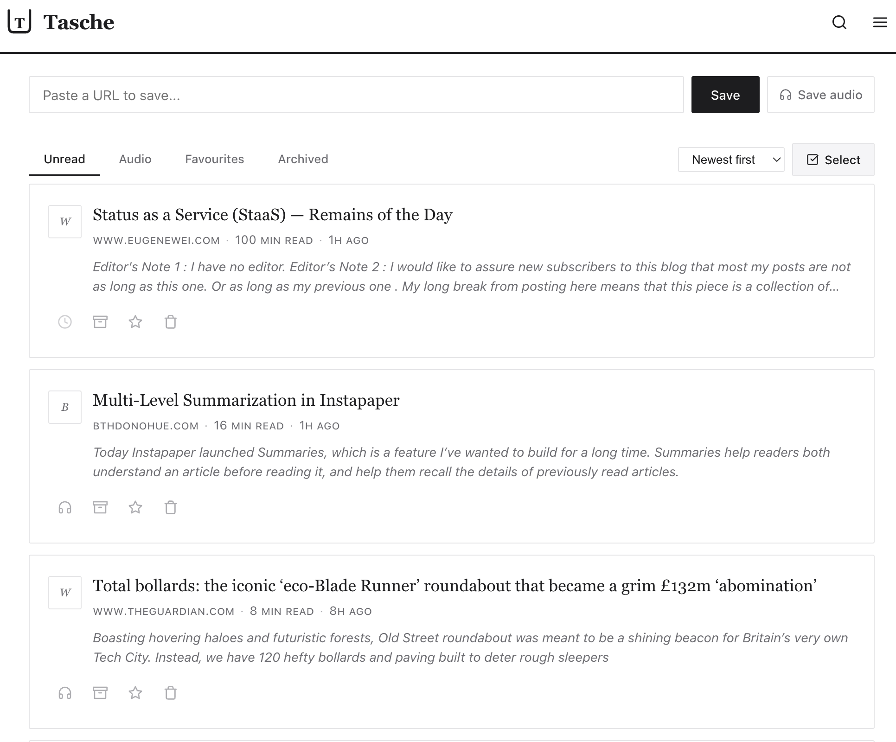

# Tasche

A self-hosted read-it-later service built on Cloudflare Python Workers. Save articles, read them offline, and listen to them as audio -- all running in your own Cloudflare account.

[](https://deploy.workers.cloudflare.com/?url=https://github.com/adewale/tasche&paid=true)



## Features

- **Save articles by URL** with automatic content extraction and archival
- **Full-text search** across your entire library (FTS5)
- **Listen Later** -- generate audio versions of articles via Workers AI TTS
- **Offline reading** -- PWA with service worker caching
- **Tags and organization** for your saved articles
- **Bookmarklet and share target** for quick saving from any browser
- **Self-hosted** -- your data stays in your Cloudflare account

## Deploy

1. Click **Deploy to Cloudflare** above. Enter your GitHub email when prompted for `ALLOWED_EMAILS`. Skip the OAuth fields for now.
2. Once deployed, note your worker URL (e.g. `https://tasche-abc.workers.dev`).
3. Create a **GitHub OAuth App** at [github.com/settings/developers](https://github.com/settings/developers). Set the callback URL to `<your-worker-url>/api/auth/callback`.
4. In the Cloudflare dashboard, go to **Workers & Pages > your worker > Settings > Variables and Secrets**. Add `GITHUB_CLIENT_ID` and `GITHUB_CLIENT_SECRET` from the OAuth app you just created.
5. Visit your worker URL and sign in.

## Manual Deploy (CLI)

If you prefer deploying from the command line:

```bash
git clone https://github.com/adewale/tasche.git
cd tasche

# Build frontend
cd frontend && npm install && npm run build && cd ..

# Set secrets (SITE_URL is auto-detected from your workers.dev URL)
uv run pywrangler secret put GITHUB_CLIENT_ID
uv run pywrangler secret put GITHUB_CLIENT_SECRET
uv run pywrangler secret put ALLOWED_EMAILS    # your GitHub email

# Deploy
make deploy-production
```

Create a GitHub OAuth App at [github.com/settings/developers](https://github.com/settings/developers):
- **Homepage URL:** your workers.dev URL (shown after deploy)
- **Callback URL:** `<your-workers-dev-url>/api/auth/callback`

### Custom domain

Edit `wrangler.jsonc` production section to add your domain:

```jsonc
"production": {
  "routes": [{ "pattern": "tasche.yourdomain.com", "custom_domain": true }]
}
```

Then deploy with `make deploy-production` and set your OAuth callback URL to `https://tasche.yourdomain.com/api/auth/callback`.

## Development

```bash
git clone https://github.com/adewale/tasche.git
cd tasche
make dev
```

That's it. `make dev` will:
1. Copy `.dev.vars.example` to `.dev.vars` (if it doesn't exist) with auth disabled
2. Install Python and frontend dependencies
3. Build the frontend
4. Apply D1 migrations to the local database
5. Start the dev server at `http://localhost:8787`

Auth is disabled by default for local development (`DISABLE_AUTH=true` in `.dev.vars`). This creates a "dev" user automatically so you can use the app without setting up GitHub OAuth. The `.dev.vars` file is gitignored and never deployed.

**Safety guard:** `DISABLE_AUTH` is blocked when `SITE_URL` is HTTPS, so it cannot accidentally run in production.

To test with real GitHub OAuth locally, edit `.dev.vars`: uncomment the OAuth lines, fill in credentials from a [GitHub OAuth App](https://github.com/settings/developers), and remove `DISABLE_AUTH=true`.

### Other commands

```bash
make check              # Run all quality gates (lint, test, format, build)
make test               # Backend unit tests
make test-e2e           # Backend E2E tests
make lint               # Backend lint + format check
make format             # Auto-format backend code
make frontend-build     # Build frontend (outputs to ./assets/)
make deploy-staging     # Quality gates + deploy to staging
make deploy-production  # Quality gates + deploy to production
```

**Note:** Use `pywrangler` (not regular `wrangler`) for Python Workers with packages. Packages are defined in `pyproject.toml`, not `requirements.txt`.

## Architecture

Tasche runs entirely on the Cloudflare Developer Platform:

| Service | Binding | Purpose |
|---------|---------|---------|
| **Python Workers** | -- | FastAPI API + queue consumer |
| **D1** | `DB` | Articles, users, tags, FTS5 search |
| **R2** | `CONTENT` | Archived HTML, markdown, images, audio |
| **KV** | `SESSIONS` | Auth sessions with 7-day TTL |
| **Queues** | `ARTICLE_QUEUE` | Async article processing and TTS |
| **Workers AI** | -- | Text-to-speech (configurable via `TTS_MODEL`, default: MeloTTS) |

**Data flow:** Save URL > API creates article (pending) > Queue consumer fetches page > Readability extracts content > Images converted to WebP > HTML + Markdown stored in R2 > FTS5 indexed in D1.

**Frontend:** Preact SPA built with Vite, served as Workers Static Assets. PWA with offline support via service worker.

See [specs/tasche-spec.md](specs/tasche-spec.md) for the full product specification.

## Cost

Requires the [Cloudflare Workers Paid plan](https://developers.cloudflare.com/workers/platform/pricing/) ($5/month as of early 2026), paid directly to Cloudflare. The free tier (100K requests/day) covers light personal use.

## License

MIT
