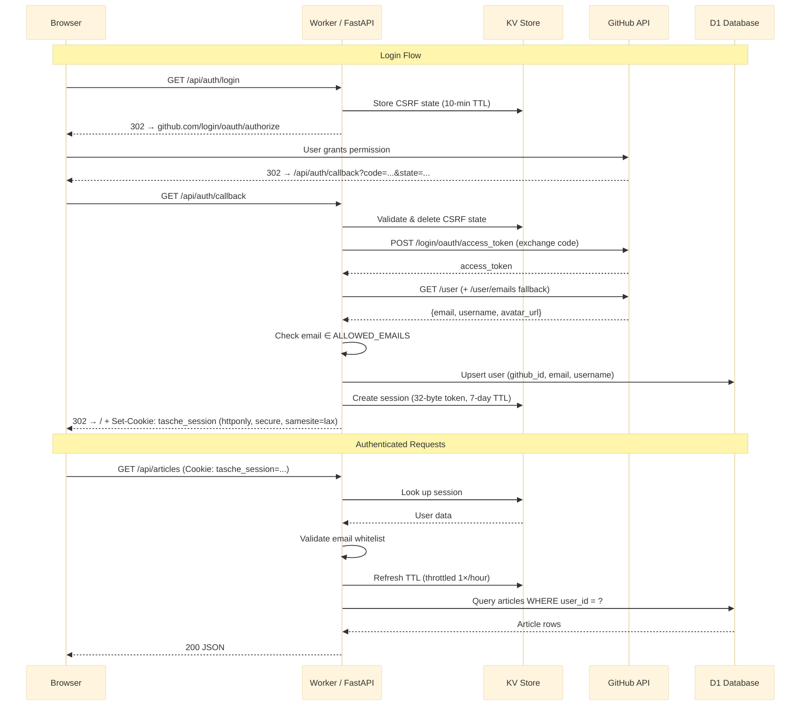
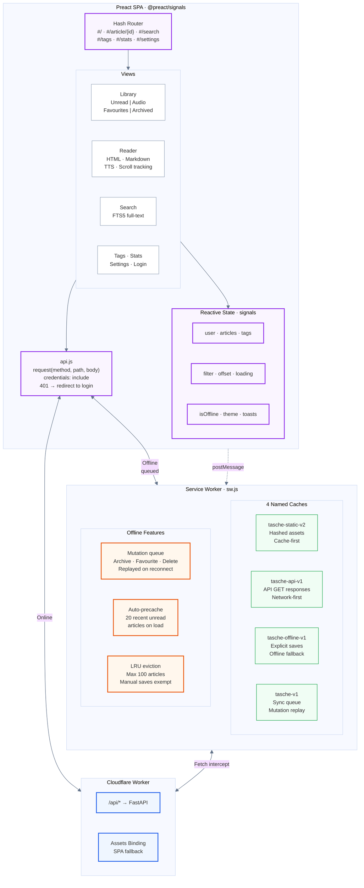
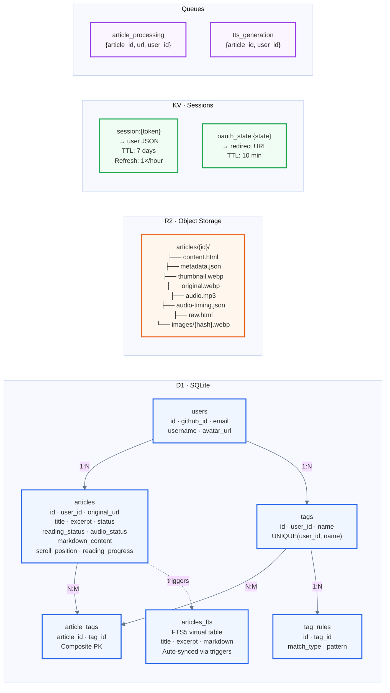
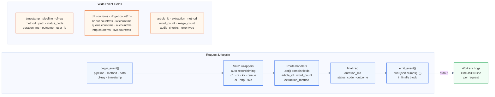

# Tasche Architecture

## System Overview

```mermaid
%%{init: {'theme': 'base', 'themeVariables': { 'primaryColor': '#f97316', 'primaryTextColor': '#1e293b', 'primaryBorderColor': '#ea580c', 'secondaryColor': '#e0f2fe', 'secondaryTextColor': '#1e293b', 'secondaryBorderColor': '#0284c7', 'tertiaryColor': '#f0fdf4', 'tertiaryTextColor': '#1e293b', 'tertiaryBorderColor': '#16a34a', 'lineColor': '#64748b', 'fontSize': '14px', 'fontFamily': 'Inter, system-ui, sans-serif' }}}%%

flowchart TB
    %% ── Browser ──
    Browser["Browser / PWA"]

    %% ── Cloudflare Edge ──
    subgraph Edge["Cloudflare Edge"]
        direction TB

        subgraph Worker["Python Worker · Pyodide on V8"]
            direction TB
            Entry["entry.py · WorkerEntrypoint"]
            Entry -->|"/api/*"| FastAPI
            Entry -->|"else"| ASSETS
            Entry -->|"queue batch"| QueueHandler["Queue Consumer"]
            Entry -->|"cron"| Scheduled["Scheduled Handler"]

            subgraph FastAPI["FastAPI · ASGI Adapter"]
                direction LR
                MW["Observability → Security → CORS"]
                Auth["Auth Middleware · get_current_user()"]
                MW --> Auth

                subgraph Routes["API Routes"]
                    direction TB
                    R_Auth["/api/auth · OAuth"]
                    R_Articles["/api/articles · CRUD"]
                    R_Search["/api/search · FTS5"]
                    R_Tags["/api/tags · Tags & Rules"]
                    R_TTS["/api/articles/*/audio · TTS"]
                    R_Stats["/api/stats · Analytics"]
                    R_Export["/api/export · JSON & HTML"]
                end
                Auth --> Routes
            end

            FFI["wrappers.py · FFI Boundary · SafeEnv"]
            FastAPI --> FFI
            QueueHandler --> FFI
            Scheduled --> FFI
        end

        %% ── Bindings ──
        subgraph Bindings["Cloudflare Bindings"]
            direction TB
            D1[("D1 · SQLite\nusers · articles · tags\narticles_fts · tag_rules")]
            R2[("R2 · Object Storage\nHTML · images · audio\nthumbnails · metadata")]
            KV[("KV · Sessions\nsession:{id} → user JSON\nTTL: 7 days")]
            Queue[("Queues\narticle_processing\ntts_generation")]
            AI["Workers AI\n@cf/deepgram/aura-2-en\nText-to-Speech"]
            Readability["Service Binding\nReadability Worker\nMozilla Readability"]
            ASSETS["Assets Binding\nPreact SPA\nSPA fallback on 404"]
        end
    end

    %% ── External ──
    subgraph External["External Services"]
        direction LR
        GitHub["GitHub OAuth\nAuthorize → Callback\nEmail whitelist"]
        BrowserRendering["Browser Rendering API\nScreenshots · JS scrape"]
        OriginalSites["Original Article Sites\nFetch · Image download\nSSRF-validated"]
    end

    %% ── Connections ──
    Browser <-->|"HTTPS\ncredentials: include"| Edge
    FFI <--> D1
    FFI <--> R2
    FFI <--> KV
    FFI <--> Queue
    FFI <--> AI
    FFI <--> Readability
    R_Auth <-.->|"OAuth flow"| GitHub
    QueueHandler <-.->|"Screenshots\nJS rendering"| BrowserRendering
    QueueHandler <-.->|"Fetch pages\nDownload images"| OriginalSites
    Scheduled <-.->|"HEAD requests\nHealth checks"| OriginalSites

    %% ── Styling ──
    classDef worker fill:#fff7ed,stroke:#ea580c,stroke-width:2px,color:#1e293b
    classDef binding fill:#eff6ff,stroke:#2563eb,stroke-width:2px,color:#1e293b
    classDef external fill:#f0fdf4,stroke:#16a34a,stroke-width:2px,color:#1e293b
    classDef browser fill:#faf5ff,stroke:#9333ea,stroke-width:2px,color:#1e293b
    classDef route fill:#fff,stroke:#94a3b8,stroke-width:1px,color:#334155
    classDef middleware fill:#fef3c7,stroke:#d97706,stroke-width:1px,color:#1e293b

    class Browser browser
    class Entry,QueueHandler,Scheduled,FFI worker
    class D1,R2,KV,Queue,AI,Readability,ASSETS binding
    class GitHub,BrowserRendering,OriginalSites external
    class R_Auth,R_Articles,R_Search,R_Tags,R_TTS,R_Stats,R_Export route
    class MW,Auth middleware
```

## Article Processing Pipeline

```mermaid
%%{init: {'theme': 'base', 'themeVariables': { 'primaryColor': '#f97316', 'lineColor': '#64748b', 'fontSize': '13px' }}}%%

flowchart LR
    subgraph Save["1 · Save"]
        POST["POST /api/articles\n{url, title?, listen_later?}"]
        Validate["Validate URL\nSSRF check\nDuplicate check"]
        Insert["INSERT article\nstatus: pending"]
        Enqueue["Enqueue\narticle_processing"]
        POST --> Validate --> Insert --> Enqueue
    end

    subgraph Process["2 · Queue Consumer · process_article()"]
        direction TB
        Fetch["Fetch page\n30s timeout · 10MB limit"]
        SSRF2["Post-redirect\nSSRF check"]
        JSCheck{"JS-heavy?\n< 500 chars\nbody text"}
        Scrape["Browser Rendering\nscrape()"]
        Extract["Extract content\nReadability → BS4 fallback"]
        Images["Download images\nConvert to WebP\nRewrite paths"]
        Screenshots["Screenshots\n1200×630 thumb\n1200×800 full"]
        Markdown["HTML → Markdown\nWord count\nReading time"]
        Store["Store to R2\ncontent.html\nmetadata.json"]
        UpdateD1["UPDATE D1\nstatus: ready\n15+ columns"]
        FTS["FTS5 auto-index\nvia D1 triggers"]
        AutoTag["Apply auto-tag\nrules"]

        Fetch --> SSRF2 --> JSCheck
        JSCheck -->|"Yes"| Scrape --> Extract
        JSCheck -->|"No"| Extract
        Extract --> Images --> Markdown
        Markdown --> Store --> UpdateD1 --> FTS --> AutoTag
        SSRF2 -.-> Screenshots -.-> Store
    end

    subgraph TTS["3 · TTS (if listen_later)"]
        direction TB
        EnqTTS["Enqueue\ntts_generation"]
        StripMD["Strip markdown\nTruncate 100K chars"]
        Chunk["Split sentences\nChunk ≤ 1900 chars"]
        AICall["Workers AI\n@cf/deepgram/aura-2-en\nper chunk"]
        Concat["Concatenate MP3"]
        StoreAudio["Store to R2\naudio.mp3\naudio-timing.json"]
        AudioReady["UPDATE D1\naudio_status: ready"]

        EnqTTS --> StripMD --> Chunk --> AICall --> Concat --> StoreAudio --> AudioReady
    end

    Enqueue ==> Fetch
    AutoTag -->|"audio_status\n= pending"| EnqTTS

    classDef save fill:#fff7ed,stroke:#ea580c,stroke-width:2px
    classDef process fill:#eff6ff,stroke:#2563eb,stroke-width:1px
    classDef tts fill:#f0fdf4,stroke:#16a34a,stroke-width:1px
    classDef decision fill:#fef3c7,stroke:#d97706,stroke-width:2px

    class POST,Validate,Insert,Enqueue save
    class Fetch,SSRF2,Scrape,Extract,Images,Screenshots,Markdown,Store,UpdateD1,FTS,AutoTag process
    class EnqTTS,StripMD,Chunk,AICall,Concat,StoreAudio,AudioReady tts
    class JSCheck decision
```

## Authentication Flow

```mermaid
%%{init: {'theme': 'base', 'themeVariables': { 'lineColor': '#64748b', 'fontSize': '13px' }}}%%

sequenceDiagram
    participant B as Browser
    participant W as Worker / FastAPI
    participant KV as KV Store
    participant GH as GitHub API
    participant D1 as D1 Database

    Note over B,D1: Login Flow
    B->>W: GET /api/auth/login
    W->>KV: Store CSRF state (10-min TTL)
    W-->>B: 302 → github.com/login/oauth/authorize

    B->>GH: User grants permission
    GH-->>B: 302 → /api/auth/callback?code=...&state=...

    B->>W: GET /api/auth/callback
    W->>KV: Validate & delete CSRF state
    W->>GH: POST /login/oauth/access_token (exchange code)
    GH-->>W: access_token
    W->>GH: GET /user (+ /user/emails fallback)
    GH-->>W: {email, username, avatar_url}

    W->>W: Check email ∈ ALLOWED_EMAILS
    W->>D1: Upsert user (github_id, email, username)
    W->>KV: Create session (32-byte token, 7-day TTL)
    W-->>B: 302 → / + Set-Cookie: tasche_session (httponly, secure, samesite=lax)

    Note over B,D1: Authenticated Requests
    B->>W: GET /api/articles (Cookie: tasche_session=...)
    W->>KV: Look up session
    KV-->>W: User data
    W->>W: Validate email whitelist
    W->>KV: Refresh TTL (throttled 1×/hour)
    W->>D1: Query articles WHERE user_id = ?
    D1-->>W: Article rows
    W-->>B: 200 JSON
```

## Frontend & Service Worker

```mermaid
%%{init: {'theme': 'base', 'themeVariables': { 'lineColor': '#64748b', 'fontSize': '13px' }}}%%

flowchart TB
    subgraph SPA["Preact SPA · @preact/signals"]
        direction TB
        Router["Hash Router\n#/ · #/article/{id} · #/search\n#/tags · #/stats · #/settings"]

        subgraph Views["Views"]
            direction LR
            Library["Library\nUnread | Audio\nFavourites | Archived"]
            Reader["Reader\nHTML · Markdown\nTTS · Scroll tracking"]
            Search["Search\nFTS5 full-text"]
            Other["Tags · Stats\nSettings · Login"]
        end

        subgraph State["Reactive State · signals"]
            direction LR
            S1["user · articles · tags"]
            S2["filter · offset · loading"]
            S3["isOffline · theme · toasts"]
        end

        API["api.js\nrequest(method, path, body)\ncredentials: include\n401 → redirect to login"]

        Router --> Views
        Views --> State
        Views --> API
    end

    subgraph SW["Service Worker · sw.js"]
        direction TB
        subgraph Caches["4 Named Caches"]
            direction LR
            C1["tasche-static-v2\nHashed assets\nCache-first"]
            C2["tasche-api-v1\nAPI GET responses\nNetwork-first"]
            C3["tasche-offline-v1\nExplicit saves\nOffline fallback"]
            C4["tasche-v1\nSync queue\nMutation replay"]
        end

        subgraph Offline["Offline Features"]
            direction LR
            MutQueue["Mutation queue\nArchive · Favourite · Delete\nReplayed on reconnect"]
            Precache["Auto-precache\n20 recent unread\narticles on load"]
            LRU["LRU eviction\nMax 100 articles\nManual saves exempt"]
        end
    end

    subgraph Worker["Cloudflare Worker"]
        direction LR
        APIGW["/api/* → FastAPI"]
        Assets["Assets Binding\nSPA fallback"]
    end

    API <-->|"Online"| Worker
    API <-->|"Offline\nqueued"| SW
    SW <-->|"Fetch intercept"| Worker
    SPA -.->|"postMessage"| SW

    classDef spa fill:#faf5ff,stroke:#9333ea,stroke-width:2px
    classDef sw fill:#fff7ed,stroke:#ea580c,stroke-width:2px
    classDef worker fill:#eff6ff,stroke:#2563eb,stroke-width:2px
    classDef cache fill:#f0fdf4,stroke:#16a34a,stroke-width:1px
    classDef view fill:#fff,stroke:#94a3b8,stroke-width:1px

    class Router,API,State,S1,S2,S3 spa
    class MutQueue,Precache,LRU sw
    class C1,C2,C3,C4 cache
    class Library,Reader,Search,Other view
    class APIGW,Assets worker
```

## Data Storage Layout

```mermaid
%%{init: {'theme': 'base', 'themeVariables': { 'lineColor': '#64748b', 'fontSize': '13px' }}}%%

flowchart LR
    subgraph D1["D1 · SQLite"]
        direction TB
        Users["users\nid · github_id · email\nusername · avatar_url"]
        Articles["articles\nid · user_id · original_url\ntitle · excerpt · status\nreading_status · audio_status\nmarkdown_content\nscroll_position · reading_progress"]
        Tags["tags\nid · user_id · name\nUNIQUE(user_id, name)"]
        ArticleTags["article_tags\narticle_id · tag_id\nComposite PK"]
        TagRules["tag_rules\nid · tag_id\nmatch_type · pattern"]
        FTS["articles_fts\nFTS5 virtual table\ntitle · excerpt · markdown\nAuto-synced via triggers"]

        Users -->|"1:N"| Articles
        Users -->|"1:N"| Tags
        Articles -->|"N:M"| ArticleTags
        Tags -->|"N:M"| ArticleTags
        Tags -->|"1:N"| TagRules
        Articles -.->|"triggers"| FTS
    end

    subgraph R2["R2 · Object Storage"]
        direction TB
        R2Layout["articles/{id}/\n├── content.html\n├── metadata.json\n├── thumbnail.webp\n├── original.webp\n├── audio.mp3\n├── audio-timing.json\n├── raw.html\n└── images/{hash}.webp"]
    end

    subgraph KVStore["KV · Sessions"]
        direction TB
        Sessions["session:{token}\n→ user JSON\nTTL: 7 days\nRefresh: 1×/hour"]
        OAuthState["oauth_state:{state}\n→ redirect URL\nTTL: 10 min"]
    end

    subgraph QueueStore["Queues"]
        direction TB
        ArticleQ["article_processing\n{article_id, url, user_id}"]
        TTSQ["tts_generation\n{article_id, user_id}"]
    end

    classDef d1 fill:#eff6ff,stroke:#2563eb,stroke-width:2px
    classDef r2 fill:#fff7ed,stroke:#ea580c,stroke-width:2px
    classDef kv fill:#f0fdf4,stroke:#16a34a,stroke-width:2px
    classDef queue fill:#faf5ff,stroke:#9333ea,stroke-width:2px

    class Users,Articles,Tags,ArticleTags,TagRules,FTS d1
    class R2Layout r2
    class Sessions,OAuthState kv
    class ArticleQ,TTSQ queue
```

## Observability · Wide Events

```mermaid
%%{init: {'theme': 'base', 'themeVariables': { 'lineColor': '#64748b', 'fontSize': '13px' }}}%%

flowchart LR
    subgraph Request["Request Lifecycle"]
        direction TB
        Begin["begin_event()\npipeline · method · path\ncf-ray · timestamp"]
        SafeWrappers["Safe* wrappers\nauto-record timing\nd1 · r2 · kv · queue\nai · http · svc"]
        Handlers["Route handlers\n.set() domain fields\narticle_id · word_count\nextraction_method"]
        Finalize["finalize()\nduration_ms\nstatus_code · outcome"]
        Emit["emit_event()\nprint(json.dumps(...))\nin finally block"]

        Begin --> SafeWrappers --> Handlers --> Finalize --> Emit
    end

    Emit -->|"stdout"| Logs["Workers Logs\nOne JSON line\nper request"]

    subgraph Event["Wide Event Fields"]
        direction TB
        Standard["timestamp · pipeline · cf-ray\nmethod · path · status_code\nduration_ms · outcome · user_id"]
        Infra["d1.count/ms · r2.get.count/ms\nr2.put.count/ms · kv.count/ms\nqueue.count/ms · ai.count/ms\nhttp.count/ms · svc.count/ms"]
        Domain["article_id · extraction_method\nword_count · image_count\naudio_chunks · error.type"]
    end

    classDef lifecycle fill:#eff6ff,stroke:#2563eb,stroke-width:1px
    classDef logs fill:#f0fdf4,stroke:#16a34a,stroke-width:2px
    classDef fields fill:#fff7ed,stroke:#ea580c,stroke-width:1px

    class Begin,SafeWrappers,Handlers,Finalize,Emit lifecycle
    class Logs logs
    class Standard,Infra,Domain fields
```
