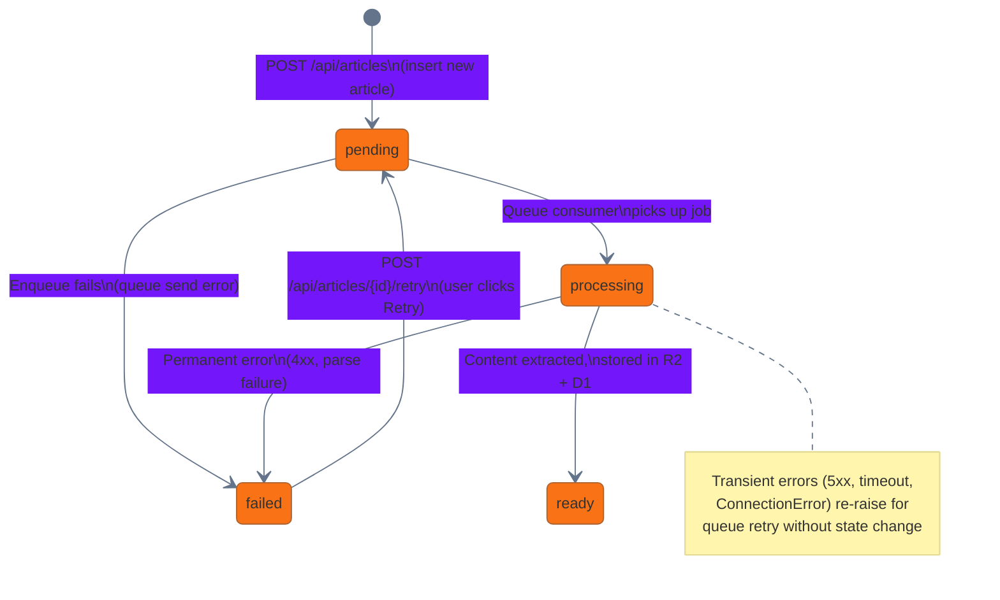
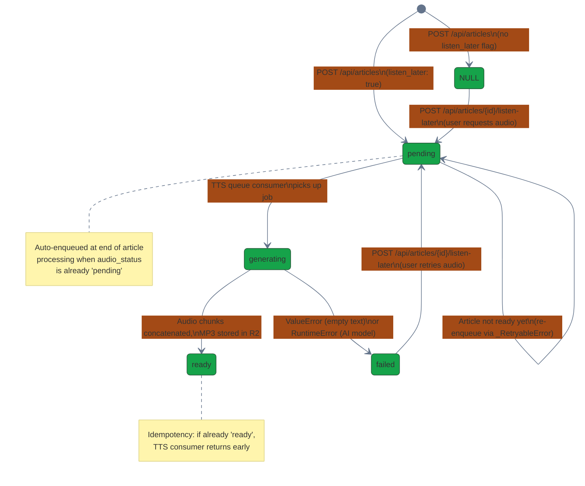
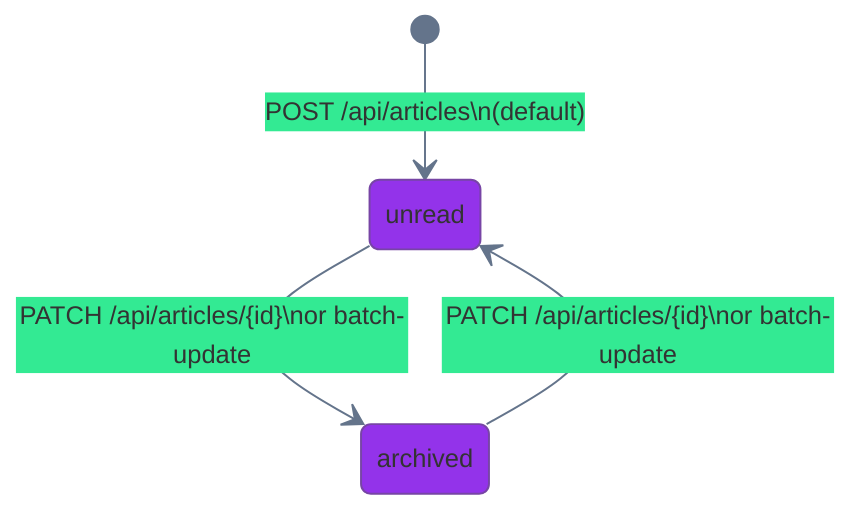
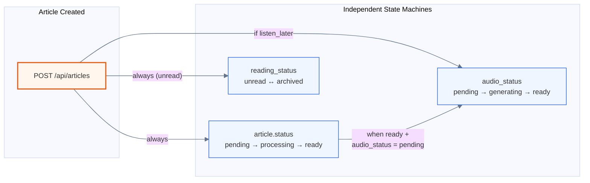

# Article State Machines

Three independent state machines govern article lifecycle in Tasche.

## Article Processing Status (`article.status`)

Tracks content extraction and processing progress.

## Audio Status (`audio_status`)

Tracks text-to-speech generation. Independent of article processing status.

## Reading Status (`reading_status`)

Tracks user reading state. Bidirectional — users can move articles back and forth.

## How They Interact

### Key dependency

Article processing must complete (`article.status = ready`) before TTS can run — the TTS consumer needs the extracted markdown. If `listen_later` was set at creation time, the article processor auto-enqueues the TTS job after reaching `ready`.
