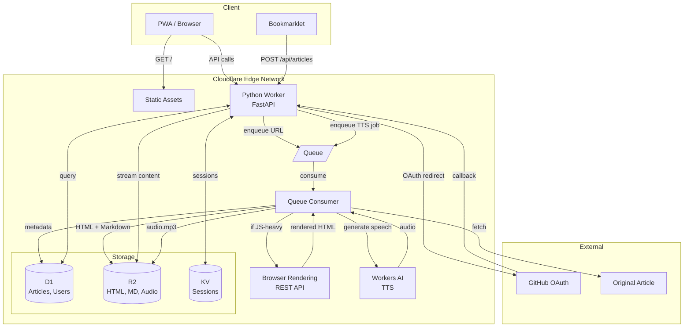

# Tasche: A Pocket Clone on Cloudflare Developer Platform

## Product Specification for Coding Agents

**Last Updated:** February 2026
**Cloudflare Compatibility Date:** 2025-12-01
**Runtime:** Python Workers (Pyodide)

---

## 1. Overview

**Tasche** (German for "pocket") is a **single-user, self-hosted** read-it-later service built entirely on the Cloudflare Developer Platform. Each user deploys their own instance—there's no multi-tenancy, no shared infrastructure, no SaaS.

### 1.0 Deployment Model

**One click, your own instance:**

1. User clicks **"Deploy to Cloudflare"** on GitHub
2. Authenticates with their Cloudflare account
3. Gets their own D1 database, R2 bucket, KV namespace, Queues
4. Data lives in their Cloudflare account, under their control

**Why self-hosted?**
- **Privacy**: Your reading history stays in your account
- **Simplicity**: No billing logic, no tenant isolation, no abuse prevention
- **Permanence**: You control the data—it doesn't disappear when a startup dies
- **Cost**: ~$5/month on Workers Paid plan, paid directly to Cloudflare

The `ALLOWED_EMAILS` env var restricts access to the owner (strict whitelist only — "first user wins" mode is not implemented). Auth is simply "is this me?"

### 1.1 Core Promise: Your Articles Survive

When you save an article, Tasche creates a **complete, self-contained archive**:
- The original might get paywalled, deleted, or the domain might expire
- **Doesn't matter**—you have your copy with all images, styling preserved
- Reader loads from R2, not the live web
- If you click the original URL and it 404s: "Original is gone. Good thing you saved it."

This is the entire point of the app. Tasche captures everything needed for a complete reading experience at save time—clean HTML, all images downloaded locally, and a full-page screenshot as fallback.

### 1.2 What Gets Archived

When you save a URL, Tasche creates a complete, self-contained archive:

| Asset | Purpose | Storage |
|-------|---------|---------|
| `original_url` | What you submitted (may have tracking params) | D1 |
| `final_url` | After redirects (t.co → real URL) | D1 |
| `canonical_url` | What the page declares as canonical | D1 |
| `content.html` | Clean HTML with localized image paths | R2 |
| `thumbnail.webp` | Above-the-fold screenshot for article cards | R2 |
| `original.webp` | Full-page scrolling screenshot for archival | R2 |
| `images/*.webp` | All article images, converted to WebP | R2 |
| `metadata.json` | Archive timestamp, image count, provenance | R2 |
| `audio.mp3` | TTS audio version (only if Listen Later enabled) | R2 |

**Why three URLs?**
- `original_url`: Detect duplicates when same article saved via different links (Twitter t.co, newsletter tracking, etc.)
- `final_url`: The actual page after redirects resolved
- `canonical_url`: What the site declares as the authoritative URL (for deduplication across shares)

**Why save images locally?**
- Images disappear faster than text (CDN expiry, hotlink protection, domain death)
- Broken image placeholders ruin reading experience
- WebP conversion saves ~30% storage vs. original formats
- Limits: 2MB per image, 10MB total per article (configurable)

**Why full-page screenshot?**
- Fallback when Readability extraction fails (infographics, complex layouts)
- Visual proof of what the page looked like when saved
- Archival value—the web changes and disappears

### 1.3 Configuration

Users forking this sample need to configure **one file** to deploy their own instance: `wrangler.jsonc`

**Key configuration for Python Workers:**

1. **`main`** - Points to Python entrypoint: `"main": "src/entry.py"`
2. **`compatibility_flags`** - Include `"python_workers"` flag
3. **Automatic provisioning** - Bindings without IDs are created on first `wrangler deploy`
4. **Static Assets** - Frontend served alongside Python API
5. **Environment variables** - `SITE_URL`, `GITHUB_CLIENT_ID`, `GITHUB_CLIENT_SECRET`

The bookmarklet, auth callbacks, and all internal URLs are derived from `SITE_URL`, so changing this single value configures the entire application.

### 1.4 Authentication: GitHub OAuth

Tasche uses **GitHub OAuth** for authentication:
- 2-minute setup at github.com/settings/developers
- No consent screen verification
- Manual implementation (no BetterAuth equivalent for Python)
- Sessions stored in KV with TTL

### 1.5 Core Features (Priority Order)

1. Save and sync content across devices
2. Offline reading capability
3. Clean reading experience (reader mode)
4. Permanent library (content preservation)
5. **Full-text search** across saved articles
6. Tagging and organization
7. Browser integration via bookmarklet
8. **Listen Later** — audio versions of articles via TTS

### 1.6 Listen Later (Text-to-Speech)

Reading requires visual attention. Listening enables multitasking—commutes, exercise, chores, walking. The "Listen Later" feature lets users explicitly mark articles for audio generation.

**User flow:**
1. User sees article in library
2. Clicks "Listen Later" button (headphone icon)
3. Article is queued for TTS processing
4. When ready, audio player appears on article
5. User listens during commute, exercise, chores
6. If generation fails, user can retry by clicking "Listen Later" again

**Why explicit opt-in:**
- No wasted compute on articles that will only be read
- User decides what's worth the audio generation cost
- Storage efficient—audio only for articles that need it
- Clear mental model: "Listen Later" is a distinct action

**Idempotency:** The listen-later endpoint MUST check `audio_status` before enqueuing:
- `pending`: Return 409 Conflict (already queued)
- `generating`: Allow re-queue as a recovery mechanism for stuck jobs (reset to `pending` and re-enqueue)
- `ready`: Return 200 with existing audio data (no re-enqueue)
- `null` or `failed`: Proceed to enqueue (new request or retry)

This prevents duplicate Workers AI invocations, which cost real compute.

**Processing flow:**
```
User clicks "Listen Later"
         │
         ▼
┌─────────────────────────────┐
│  POST /api/articles/:id/    │
│       listen-later          │
│                             │
│  1. Set audio_status =      │
│     'pending'               │
│  2. Enqueue TTS job         │
└─────────────────────────────┘
         │
         ▼
┌─────────────────────────────────┐
│  TTS Queue Consumer             │
│                                 │
│  1. Fetch markdown from D1      │
│  2. Strip markdown syntax →     │
│     plain text (no #, **, [],   │
│     code blocks, HTML tags)     │
│  3. Truncate to 100K chars      │
│     (append "...truncated" note)│
│  4. Call Workers AI:            │
│     TTS_MODEL (default: melotts)│
│  5. Store audio.mp3 → R2        │
│  6. Update D1:                  │
│     - audio_key                 │
│     - audio_duration_seconds    │
│     - audio_status = 'ready'    │
└─────────────────────────────────┘
         │
         ▼
   Audio player appears
   on article card/view
```

**Workers AI model:** Configurable via `TTS_MODEL` env var. Default: `melotts` (`@cf/myshell-ai/melotts`). Also supports `aura-2-en`, `aura-2-es`, `aura-1` (Deepgram). See `docs/tts-models.md` for cost comparison and quality notes. All models run on Cloudflare's edge, no external API keys needed.

**R2 storage:** Audio stored as `articles/{id}/audio.mp3`. Zero egress fees mean offline audio sync doesn't blow up costs.

**PWA audio features:**
- Play/pause, skip ±15s, playback speed (0.75x, 1x, 1.25x, 1.5x, 1.75x, 2x)
- Background playback (continues when screen off)
- Offline sync: "Download for offline listening" caches audio to device
- Listen Later queue: filtered view of articles with audio ready

### 1.7 Content Storage Philosophy

Tasche stores articles in **dual format**:

| Format | Purpose | Storage |
|--------|---------|---------|
| **Original HTML** | Preserve exact rendering, images, styling | R2 |
| **Markdown** | Search indexing, AI processing, clean reading | R2 + D1 FTS5 |

**Why both?**
- **HTML** preserves the author's intent—formatting, images, and layout
- **Markdown** is ideal for full-text search (FTS5), AI summarization, and clean reader mode
- Storing both costs minimal extra R2 storage but unlocks powerful features

---

## 1.8 User Journeys

### Save an Article (Bookmarklet)

1. User reads an article on the web
2. Clicks bookmarklet in browser toolbar
3. Bookmarklet opens a small popup window at `/bookmarklet?url=...&title=...` — this is a top-level navigation to Tasche's own origin, so `SameSite=Lax` session cookies are included
4. The popup page makes a same-origin `POST /api/articles`, shows "Saved!", and auto-closes after 1.5 seconds
5. Article appears in library within seconds (thumbnail, title, excerpt)
6. Original page can now disappear—user has their copy

**Important:** The bookmarklet MUST use `window.open()` (top-level navigation), NOT `fetch()`. Cross-origin `fetch()` with `credentials: 'include'` will not send `SameSite=Lax` cookies. The frontend generates the bookmarklet code dynamically with the correct origin baked in.

### Save an Article (Share Sheet / Mobile)

1. User taps Share on mobile browser
2. Selects "Tasche" from share targets
3. App opens briefly, confirms save
4. Returns to original browser

### Read Offline

1. User opens PWA while connected
2. Library syncs, articles cache in background
3. User goes offline (subway, airplane)
4. Opens PWA—cached articles load instantly
5. Reading progress syncs when back online

### Search Library

1. User types in search box
2. Input is sanitized: FTS5 operators stripped, each word quoted as a literal (see §9.2)
3. FTS5 searches title, excerpt, and full markdown content, ordered by relevance (`rank`)
4. Results highlight matching terms
5. User clicks result → opens reader view

### Listen Later

1. User sees article they want to hear
2. Taps headphone icon → "Generating audio..."
3. If already pending/generating, shows status (does not re-enqueue)
4. Notification when ready (or polls on next open)
5. Audio player appears on article card
6. User listens during commute with background playback
7. If generation failed, "Listen Later" button reappears for retry

### Tag and Organize

1. User opens article
2. Taps tag icon → shows existing tags + "Add new"
3. Types tag name, presses enter
4. Tag appears on article, filterable in library

### Original Disappeared

1. User clicks "View Original" on saved article
2. Browser opens original URL → 404 or paywall
3. Returns to Tasche → article still fully readable
4. UI shows: "Original is gone. Good thing you saved it."

---

## 2. Python Workers Libraries

This section documents the specific libraries chosen for Tasche and why they work well with Python Workers on Cloudflare.

**Important:** Python Workers run on Pyodide (WebAssembly). Use `pywrangler` (not regular wrangler) to deploy Workers with packages. Packages are defined in `pyproject.toml`.

**Confirmed working** (from [cloudflare/python-workers-examples](https://github.com/cloudflare/python-workers-examples)):
- FastAPI, D1 queries, KV bindings, R2, Durable Objects, Queues
- Workers AI, Workflows, Cron triggers, HTMLRewriter
- Static Assets, WebSocket streams

### 2.1 Core Framework

| Library | Version | Purpose | Status |
|---------|---------|---------|--------|
| **FastAPI** | ^0.110.x | Web framework | ✅ Official example (03-fastapi) |
| **asgi** | (built-in) | ASGI adapter | ✅ Provided by Workers runtime |

**FastAPI pattern** (from official example):

```python
from workers import WorkerEntrypoint
import asgi
from fastapi import FastAPI, Request

app = FastAPI()

@app.get("/")
async def root(request: Request):
    env = request.scope["env"]  # Access bindings
    return {"message": "Hello"}

class Worker(WorkerEntrypoint):
    async def fetch(self, request):
        return await asgi.fetch(app, request.js_object, self.env)
```

**Key points:**
- Use `request.js_object` (raw JS Request) for the ASGI adapter
- Access bindings via `request.scope["env"]` in route handlers
- All handlers must be `async def` (no sync handlers—threading unsupported)

### 2.2 Authentication: Manual GitHub OAuth

Python Workers don't have a BetterAuth equivalent, so we implement GitHub OAuth directly. It's straightforward:

1. Redirect user to GitHub's authorize URL
2. GitHub redirects back with a code
3. Exchange code for access token
4. Fetch user info from GitHub API
5. Create session in KV

**Session management:**
- Generate session ID with `secrets.token_urlsafe(32)`
- Store session data in KV with TTL
- Set HTTP-only cookie with session ID
- Validate session on each request via middleware

### 2.3 Database: Raw SQL

| Library | Version | Purpose | Why It Works |
|---------|---------|---------|--------------|
| **sqlite3** | (stdlib) | SQL interface | D1 bindings expose same interface |

No ORM needed. D1's Python bindings work like standard sqlite3:

- `env.DB.execute(sql, params)` for queries
- `env.DB.fetchone()`, `env.DB.fetchall()` for results
- Parameterized queries prevent SQL injection

For a simple schema like Tasche's, raw SQL is clearer than an ORM anyway.

### 2.4 Content Extraction & Parsing

| Library | Version | Purpose | Pyodide Status |
|---------|---------|---------|----------------|
| **beautifulsoup4** | ^4.12.x | HTML parsing, fallback extraction | ✅ Available |
| **markdownify** | ^0.11.x | HTML to Markdown | ✅ Pure Python |
| **httpx** | ^0.27.x | HTTP client | ✅ Available |

**Content extraction: Readability Service Binding with BeautifulSoup fallback.**
`python-readability` is **not used** — it calls `js.eval()` to load Mozilla Readability JS, which is blocked in Workers (`EvalError: Code generation from strings disallowed`). Instead, content extraction uses a **Readability Service Binding** to a separate JS Worker that runs @mozilla/readability natively, with BeautifulSoup as a fallback when the service binding is unavailable or extraction fails.

### 2.5 Browser Rendering: REST API

Python Workers can't use the Puppeteer binding directly. Instead, use Cloudflare's Browser Rendering REST API:

**Endpoints:**
- `POST /screenshot` — Capture page as image
- `POST /scrape` — Extract rendered HTML after JavaScript execution

**Usage from Python:**

```
POST https://api.cloudflare.com/client/v4/accounts/{account_id}/browser-rendering/screenshot
Authorization: Bearer {api_token}

{
  "url": "https://example.com/article",
  "viewport": { "width": 1200, "height": 630 },
  "fullPage": true
}
```

**Tradeoffs vs Puppeteer binding:**
- Less control (can't interact with page, fill forms, etc.)
- Requires API token management
- Slightly higher latency (external API call vs binding)
- Works from any language

For Tasche's use case (screenshot + scrape HTML), the REST API is sufficient.

### 2.6 ID Generation

| Library | Version | Purpose | Why It Works |
|---------|---------|---------|--------------|
| **secrets** | (stdlib) | Secure random IDs | Built into Python, cryptographically secure |

Use `secrets.token_urlsafe(16)` for 22-character URL-safe IDs, or `uuid.uuid4()` for standard UUIDs.

### 2.7 Libraries to AVOID

| Library | Reason |
|---------|--------|
| `lxml` (standalone) | C extension may not work in Pyodide |
| `readability-lxml` | Requires lxml |
| `python-readability` | Calls `js.eval()` which is blocked in Workers (`EvalError`). Use Readability Service Binding instead. |
| `playwright` | No Python Workers support |
| `selenium` | Requires browser binary |
| `requests` | Use `httpx` instead (async support) |
| Any C-extension library | Must be pre-compiled for Pyodide |

### 2.8 Python Workers Runtime Constraints

Python Workers run Python via Pyodide (WebAssembly) inside V8 isolates. Key constraints:

**No threading:**
- `RuntimeError: can't start new thread` if any library uses threads
- All FastAPI dependencies must be `async def` (sync handlers cause thread dispatch)
- Avoid libraries that use `concurrent.futures`, `threading`, or `multiprocessing`

**JsProxy and .to_py():**
- JS objects crossing into Python become `JsProxy` objects
- To use them as native Python dicts/lists, call `.to_py()`
- Example: `rows = (await env.DB.execute(sql)).to_py()`

**request.js_object:**
- Some JS APIs need the raw JS Request/Response, not the Python wrapper
- FastAPI's ASGI adapter: `await asgi.fetch(app, request.js_object, self.env)`
- HTMLRewriter: `HTMLRewriter().transform(response.js_object)`

**Accessing bindings in FastAPI:**
- Bindings are on `request.scope["env"]`, not directly on `self.env`
- Example: `db = request.scope["env"].DB`

**Per-isolate initialization:**
- `WorkerEntrypoint` class instances persist across requests within the same V8 isolate
- Use class attributes (not instance attributes) for cached routers, initialized state
- This avoids re-initialization overhead on every request

**Static Assets architecture:**
- Static files (CSS, JS, images) served directly from Cloudflare's edge
- They do NOT invoke the Python Worker at all
- Only API routes hit your Python code

---

### 3.1 Why Each Cloudflare Primitive Was Chosen

This section explains the architectural decisions behind Tasche and why each Cloudflare service was selected. Understanding these choices helps developers learn how to compose Cloudflare's primitives for their own applications.

#### **Workers** → API Backend & Queue Consumer

**What it does:** Serverless Python execution at the edge via Pyodide (WebAssembly).

**Why Workers for Tasche:**
- **Global low-latency API**: Users access their reading list from anywhere. Workers run in 300+ locations, so API responses are fast regardless of where the user is.
- **No cold starts**: V8 isolates provide sub-millisecond startup. When a user opens the PWA, the article list loads instantly.
- **Cost-effective**: The free tier (100K requests/day) covers most personal use. Paid plan ($5/mo) includes 10M requests.
- **Native integrations**: Workers have first-class bindings to D1, R2, KV, Queues, and Browser Rendering—no SDK configuration needed.

---

#### **D1** → Relational Database (Users, Articles, Tags)

**What it does:** Serverless SQLite database with automatic replication.

**Why D1 for Tasche:**
- **Relational data model**: Articles have tags (many-to-many), users have articles (one-to-many), reading progress tracks position per article. SQL handles these relationships naturally.
- **Read replicas**: D1 automatically replicates reads globally. When a user in Tokyo opens their library, the query hits a nearby replica—not a single origin database.
- **Familiar SQL**: No new query language to learn. Standard SQLite syntax works.
- **Zero configuration**: No connection strings, connection pooling, or VPC setup. Just bind and query.
- **10GB per database**: More than enough for article metadata. A user with 10,000 saved articles uses ~50MB.

**Why NOT D1 for article content:** Article HTML can be large (50KB-500KB each). Storing blobs in SQLite is inefficient and would quickly hit the 10GB limit. That's why content goes to R2.

---

#### **R2** → Object Storage (Article Content, Thumbnails)

**What it does:** S3-compatible object storage with zero egress fees.

**Why R2 for Tasche:**
- **Large blob storage**: Article HTML (50KB-500KB), thumbnails (20KB-100KB), and images don't belong in a database. R2 handles objects up to 5TB.
- **Zero egress fees**: When a user reads an article, that's egress. With R2, storage is the only cost ($0.015/GB/mo).
- **PWA offline sync**: The Service Worker can cache article content from R2. When the user goes offline (subway, airplane), cached articles are available. Zero egress means this caching strategy doesn't blow up costs.
- **CDN integration**: R2 objects can be served through Cloudflare's CDN with caching, making repeated reads of popular articles instant.
- **Permanent archive**: Even if the original article disappears from the web, Tasche's copy in R2 persists. This is the core value proposition.

**Storage structure:**

**Why archive images?**
- Images disappear faster than articles (CDN expiry, hotlink protection, domain death)
- Rewritten to local paths in `content.html` for reliable rendering
- WebP format: 30% smaller than JPEG at same quality

**Why full-page screenshot?**
- Some content doesn't extract well (infographics, complex layouts)
- Visual proof of original appearance
- "View original" fallback when reader mode fails
- Archive value—web pages change and disappear

---

#### **KV** → Session Storage & Caching

**What it does:** Global key-value store with millisecond reads.

**Why KV for Tasche:**
- **Session tokens**: After GitHub OAuth, the session ID maps to user data. KV's global distribution means session validation is fast everywhere. TTL support auto-expires sessions.
- **OAuth state**: CSRF tokens for the OAuth flow need temporary storage (10 minutes). KV's TTL handles cleanup automatically.
- **Eventually consistent is fine**: Sessions don't need strong consistency. If a user logs out, a 60-second propagation delay is acceptable.
- **High read throughput**: KV is optimized for read-heavy workloads. Session checks happen on every authenticated request.

**What KV is NOT used for:**
- *Article metadata*: Needs relational queries (filter by tag, sort by date). → D1
- *Article content*: Large blobs, write-once-read-many. → R2
- *Job queues*: Need guaranteed delivery and ordering. → Queues

**Alternative considered:**
- *D1 for sessions*: Works, but adds database load for simple key lookups. KV is purpose-built for this.
- *Durable Objects*: Overkill for sessions. DO is for stateful coordination, not simple storage.

---

#### **Queues** → Background Article Processing

**What it does:** Message queue with guaranteed delivery, retries, and batching.

**Why Queues for Tasche:**
- **Decouple save from process**: When a user clicks "Save," the API immediately returns success. The heavy work (fetching page, extracting content, generating thumbnail) happens asynchronously.
- **User experience**: Save operations feel instant (<100ms) instead of waiting 5-10 seconds for page processing.
- **Retry on failure**: If Browser Rendering times out or the page is temporarily unavailable, Queues automatically retry with exponential backoff. See §10.1 for error categorization (transient vs. permanent).
- **Rate limit compliance**: Browser Rendering allows 2 new browsers/minute. Queue's `max_batch_timeout: 60` ensures we don't exceed this limit.
- **Batch processing**: Multiple saves can be processed together, reducing Browser Rendering overhead.

**Flow:**
```
User saves URL → POST /api/articles
                      │
                      ▼
┌─────────────────────────────────────┐
│  API Handler (~50ms response)       │
│  1. Validate URL (scheme, format,   │
│     SSRF blocklist — see §9.1)      │
│  2. Validate field lengths (§5.1)   │
│  3. Check duplicates (all 3 URLs)   │
│  4. Create article (status:pending) │
│  5. Enqueue processing job          │
│  6. Return { id, status: 'pending' }│
└─────────────────────────────────────┘
                      │
                      ▼
┌─────────────────────────────────────┐
│  Queue Consumer (async, retries)    │
│                                     │
│  1. Spawn headless browser          │
│  2. Navigate, follow redirects      │
│     → capture final_url             │
│     → validate final_url against    │
│       SSRF blocklist (see §9.1)     │
│  3. Extract canonical_url from DOM  │
│  4. Full-page screenshot → R2       │
│  5. Thumbnail screenshot → R2       │
│  6. Readability extracts content    │
│  7. Download + convert images       │
│     → validate each URL (§9.1)      │
│     → skip private network URLs     │
│     → R2 images/*.webp              │
│  8. Rewrite HTML with local paths   │
│  9. Convert to Markdown (Turndown)  │
│ 10. Store content.html → R2         │
│ 11. Store metadata.json → R2        │
│ 12. Update D1:                      │
│     - title, excerpt, word_count    │
│     - reading_time, status: 'ready' │
│     - all three URLs                │
│ 13. Index in FTS5                   │
└─────────────────────────────────────┘
                      │
                      ▼
        Article appears in library
        with thumbnail and metadata
```

**Alternative considered:**
- *Synchronous processing*: Terrible UX. User waits 5-10 seconds staring at a spinner.

---

#### **Browser Rendering REST API** → Page Fetching & Screenshots

**What it does:** Headless Chromium browsers running on Cloudflare's edge, accessible via REST API.

**Why Browser Rendering for Tasche:**
- **JavaScript rendering**: Modern websites are SPAs. A simple `fetch()` gets empty HTML shells. Browser Rendering executes JavaScript and returns the fully-rendered DOM.
- **Accurate content extraction**: BeautifulSoup/readability work best on rendered HTML. Paywalls, lazy-loaded content, and dynamic elements are handled.
- **Thumbnail generation**: The `/screenshot` endpoint creates visual previews. Users can identify articles by thumbnail in the PWA.
- **No infrastructure**: No Docker containers, no browser servers, no Chrome installation. Just REST API calls.

**REST API endpoints:**
- `POST /screenshot` — Full-page or viewport screenshot as PNG/JPEG
- `POST /scrape` — Rendered HTML after JavaScript execution

**Constraints addressed:**
- *Rate limits*: Queue batching with 60-second timeout keeps us under limit.
- *$0.02 per 1,000 sessions*: Acceptable for personal use (100 articles/month = $0.002).

---

#### **Workers Static Assets** → PWA Frontend Hosting

**What it does:** Serve static files (HTML, CSS, JS, images) directly from Workers with global CDN caching.

**Why Workers Static Assets for Tasche:**
- **Unified deployment**: API and frontend deploy together with a single `wrangler deploy`
- **PWA support**: Serves the app shell, manifest.json, and Service Worker. Users can "Add to Home Screen" and get an app-like experience.
- **SPA routing**: Configure `not_found_handling = "none"` — the Worker handles SPA fallback manually in its `fetch()` handler
- **Offline-first**: The Service Worker intercepts requests and serves cached articles when offline
- **Global CDN**: Assets cached at 300+ edge locations

**Configuration in wrangler.jsonc:**

```jsonc
{
  "assets": {
    "directory": "./dist/client",
    "not_found_handling": "none"
  }
}
```

**Why not `"single-page-application"`?** The `single-page-application` setting intercepts browser navigation requests (`Sec-Fetch-Mode: navigate`) to *all* paths — including API paths like `/api/auth/login` — and serves `index.html` instead of forwarding to the Worker. This silently breaks OAuth login and any other API endpoint accessed via browser navigation. The Worker handles SPA fallback manually: it routes `/api/*` to FastAPI, delegates everything else to `env.ASSETS.fetch()`, and returns `/index.html` for asset 404s.

**PWA architecture:**

---

### 3.2 How the Primitives Compose Together

```
┌─────────────────────────────────────────────────────────────────────────┐
│                              USER DEVICE                                 │
│  ┌─────────────────────────────────────────────────────────────────┐    │
│  │                    PWA (from Workers Static Assets)              │    │
│  │  ┌─────────────┐  ┌─────────────┐  ┌─────────────────────────┐  │    │
│  │  │ App Shell   │  │  Service    │  │  IndexedDB              │  │    │
│  │  │ (cached)    │  │  Worker     │  │  (offline article cache)│  │    │
│  │  └─────────────┘  └──────┬──────┘  └─────────────────────────┘  │    │
│  └──────────────────────────┼──────────────────────────────────────┘    │
└─────────────────────────────┼───────────────────────────────────────────┘
                              │ HTTPS
┌─────────────────────────────┼───────────────────────────────────────────┐
│                     CLOUDFLARE EDGE                                      │
│                              │                                           │
│  ┌───────────────────────────▼───────────────────────────────────────┐  │
│  │                   Python Workers (API + Static Assets)            │  │
│  │  • Authentication (GitHub OAuth)                                  │  │
│  │  • Article CRUD                                                    │  │
│  │  • Tag management                                                  │  │
│  │  • Reading progress sync                                           │  │
│  │  • Static asset serving (SPA with client-side routing)            │  │
│  └───┬─────────────┬─────────────┬─────────────┬────────────────┬────┘  │
│      │             │             │             │                │        │
│      ▼             ▼             ▼             ▼                ▼        │
│  ┌───────┐    ┌────────┐   ┌─────────┐   ┌─────────┐    ┌────────────┐  │
│  │  D1   │    │   R2   │   │   KV    │   │ Queues  │    │  Browser   │  │
│  │       │    │        │   │         │   │         │    │  Rendering │  │
│  │Users  │    │Article │   │Sessions │   │Process  │    │  REST API  │  │
│  │Articles│   │Content │   │         │   │Jobs     │───▶│ Screenshot │  │
│  │Tags   │    │Thumbnails  │         │   │         │    │ Scrape     │  │
│  └───────┘    └────────┘   └─────────┘   └────┬────┘    └────────────┘  │
│                                               │                          │
│                                               ▼                          │
│                                    ┌──────────────────┐                  │
│                                    │  Queue Consumer  │                  │
│                                    │  (Worker)        │                  │
│                                    │                  │                  │
│                                    │  • Fetch via BR  │                  │
│                                    │  • Extract text  │                  │
│                                    │  • Store to R2   │                  │
│                                    │  • Update D1     │                  │
│                                    └──────────────────┘                  │
│                                                                          │
└──────────────────────────────────────────────────────────────────────────┘
```

### 3.3 Offline PWA Architecture

The PWA is designed for true offline reading—users should be able to read saved articles on airplanes, subways, or anywhere without connectivity.

**Service Worker Strategy:**

**Offline sync strategy:**

1. **Eager caching**: When user views article list, background-fetch article content for unread items
2. **Manual save for offline**: "Save for offline" button explicitly caches article content
3. **Queue offline actions**: If user archives/favorites while offline, queue action and sync when online
4. **Background sync**: Use Background Sync API to retry queued actions
5. **Queue deduplication**: Deduplicate queued requests by URL + HTTP method (last-write-wins). Toggling a favorite on/off/on while offline should result in one request, not three. See §10.8.
6. **Cache preservation**: The service worker MUST preserve the sync queue cache during activation. See §10.7.

**Why this works with Cloudflare:**
- **R2 zero egress**: Caching article content doesn't increase costs
- **Workers global**: Even cache misses are fast due to edge execution
- **KV sessions**: Session validation works at edge, reducing round-trips

---


### 3.4 System Architecture Diagram

**Component overview:**

```
┌─────────────────────────────────────────────────────────────────────┐
│                      Cloudflare Edge Network                        │
├─────────────────────────────────────────────────────────────────────┤
│                                                                     │
│  ┌───────────────┐    ┌─────────────────────────────────────────┐  │
│  │ Static Assets │    │         Python Worker (FastAPI)         │  │
│  │   (PWA/SPA)   │    │  ┌─────────────┐  ┌─────────────────┐   │  │
│  └───────────────┘    │  │  API Routes │  │ Queue Consumer  │   │  │
│                       │  │  + OAuth    │  │ (Articles, TTS) │   │  │
│                       │  └─────────────┘  └─────────────────┘   │  │
│                       └─────────────────────────────────────────┘  │
│                                      │                              │
│         ┌────────────────────────────┼────────────────────┐        │
│         ▼                            ▼                    ▼        │
│  ┌─────────────┐  ┌─────────────┐  ┌──────┐  ┌─────────────────┐  │
│  │     D1      │  │     R2      │  │  KV  │  │     Queues      │  │
│  │  Database   │  │   Content   │  │ Sess │  │   Processing    │  │
│  └─────────────┘  └─────────────┘  └──────┘  └─────────────────┘  │
│                                                                     │
│  ┌─────────────────────────────┐  ┌─────────────────────────────┐  │
│  │   Browser Rendering API     │  │        Workers AI           │  │
│  │  (JS-heavy site scraping)   │  │   (TTS: configurable model)  │  │
│  └─────────────────────────────┘  └─────────────────────────────┘  │
│                                                                     │
└─────────────────────────────────────────────────────────────────────┘
          │                              │
          ▼                              ▼
   ┌─────────────┐                ┌─────────────┐
   │   GitHub    │                │  Original   │
   │   OAuth     │                │  Articles   │
   └─────────────┘                └─────────────┘
```

**Data flow diagram (Mermaid):**



**Key flows:**
1. **Save article**: Bookmarklet/PWA → API → Queue → Consumer fetches URL (via Browser Rendering if needed) → stores metadata in D1, content in R2
2. **Read article**: PWA → API → D1 for metadata → R2 for content (streamed)
3. **Listen Later**: PWA → API → Queue → Consumer → Workers AI generates audio → R2
4. **Auth**: PWA → API → GitHub OAuth → callback → session stored in KV

---

## 4. Cloudflare Services Mapping

| Feature | Cloudflare Service | Purpose |
|---------|-------------------|---------|
| API Backend | Python Workers | Request handling, business logic (FastAPI) |
| Frontend Hosting | Workers Static Assets | Preact SPA with PWA support |
| Database | D1 | Users, articles, tags, metadata |
| Content Storage | R2 | Archived HTML, Markdown, thumbnails, audio |
| Session Management | KV | Auth sessions with TTL |
| Background Processing | Queues | Article fetching, content extraction, TTS generation |
| Content Extraction | Browser Rendering REST API | Screenshot and HTML scraping |
| Readability Extraction | Service Binding (`READABILITY`) | @mozilla/readability via separate JS Worker, BeautifulSoup fallback |
| Authentication | Manual GitHub OAuth | OAuth flow with KV sessions |
| Listen Later (TTS) | Workers AI | Text-to-speech via configurable `TTS_MODEL` (default: MeloTTS) |

---

### 5.1 D1 Database Schema

**Articles table key fields:**

| Field | Type | Max Length | Purpose |
|-------|------|-----------|---------|
| `id` | TEXT | 22 | Primary key (`secrets.token_urlsafe(16)`) |
| `user_id` | TEXT | 22 | Owner reference |
| `original_url` | TEXT | 2048 | URL as submitted |
| `final_url` | TEXT | 2048 | After redirects |
| `canonical_url` | TEXT | 2048 | Page's declared canonical |
| `domain` | TEXT | 255 | Extracted hostname for display |
| `title` | TEXT | 500 | Article title |
| `excerpt` | TEXT | 1000 | Short description |
| `author` | TEXT | 255 | Byline if available |
| `word_count` | INTEGER | — | For reading time estimates |
| `reading_time_minutes` | INTEGER | — | Calculated at ~200 WPM |
| `image_count` | INTEGER | — | Number of images archived |
| `status` | TEXT | — | 'pending', 'processing', 'ready', 'failed' |
| `reading_status` | TEXT | — | 'unread', 'archived' |
| `is_favorite` | INTEGER | — | 0 or 1 |
| `audio_key` | TEXT | — | R2 path to audio.mp3 |
| `audio_duration_seconds` | INTEGER | — | For playlist time budgeting |
| `audio_status` | TEXT | — | 'pending', 'generating', 'ready', 'failed' |
| `html_key` | TEXT | — | R2 path to content.html |
| `thumbnail_key` | TEXT | — | R2 path to thumbnail.webp |
| `original_key` | TEXT | — | R2 path to original.webp (full-page screenshot) |
| `markdown_content` | TEXT | — | Full Markdown for FTS5 indexing and TTS source |
| `scroll_position` | REAL | — | Reading scroll position (0–1 percentage), default 0 |
| `reading_progress` | REAL | — | Reading progress (0–1 percentage), default 0 |
| `original_status` | TEXT | — | URL health: 'available', 'paywalled', 'gone', 'domain_dead', 'unknown' |
| `last_checked_at` | TEXT | — | When `original_status` was last verified (ISO 8601) |
| `created_at` | TEXT | — | When saved (ISO 8601 with timezone) |
| `updated_at` | TEXT | — | Last modified (ISO 8601 with timezone) |

**Input validation:** All user-supplied text fields MUST be validated at the API boundary:
- `url`: max 2048 characters, must be `http` or `https` scheme
- `title`: max 500 characters
- Return 400 with a clear error message when limits are exceeded

**Uniqueness:** A `UNIQUE(user_id, original_url)` index prevents duplicate articles per user. When a duplicate URL is detected (matching `original_url`, `final_url`, or `canonical_url`), the API **re-processes the existing article** — it resets `status` to `pending`, re-enqueues the article for processing, and returns **201 with `updated: true` and the original `created_at`**. This lets users "re-save" an article to refresh its content. A 409 Conflict is only returned if a race-condition unique constraint violation occurs during INSERT.

**Tags table:**

| Field | Type | Max Length | Purpose |
|-------|------|-----------|---------|
| `name` | TEXT | 100 | Tag display name |

Tag names are validated to max 100 characters at the API boundary.

### 5.2 R2 Storage Structure

**Content Storage:**

| Location | Content | Purpose |
|----------|---------|---------|
| **D1** `markdown_content` | Full Markdown text | FTS5 search indexing, TTS source |
| **R2** `content.html` | Clean HTML with styling | Reader mode rendering |

**Content formats per consumer:**

| Consumer | Format | Source | Notes |
|----------|--------|--------|-------|
| Reader view | Clean HTML | R2 `content.html` via `GET /api/articles/:id/content` | Primary display format with local image paths |
| Reader fallback | Rendered markdown | D1 `markdown_content` | Used when R2 content unavailable |
| FTS5 search | Markdown text | D1 `markdown_content` | Indexed via FTS5 triggers |
| TTS | Plain text | Derived from D1 markdown | Strip all markup before sending to TTS model |

**API content endpoint:** `GET /api/articles/:id/content` serves the clean HTML from R2 as `text/html`. The frontend should try this endpoint first and fall back to rendering `markdown_content` if it returns 404 or fails.

---

### 5.1 Authentication Endpoints

GitHub OAuth requires these endpoints:

| Endpoint | Method | Purpose |
|----------|--------|---------|
| `/api/auth/login` | GET | Redirect to GitHub authorize URL |
| `/api/auth/callback` | GET | Handle GitHub callback, create session |
| `/api/auth/logout` | POST | Delete session from KV |
| `/api/auth/session` | GET | Return current user info |

**OAuth flow:**
1. User visits `/api/auth/login`
2. Redirect to `https://github.com/login/oauth/authorize?client_id=...&redirect_uri=...&scope=user:email`
3. User authorizes on GitHub
4. GitHub redirects to `/api/auth/callback?code=...`
5. Exchange code for access token via POST to `https://github.com/login/oauth/access_token`
6. Fetch user info from `https://api.github.com/user`
7. Create or update user in D1
8. Generate session ID with `secrets.token_urlsafe(32)`
9. Store session in KV with 7-day TTL
10. Set HTTP-only cookie with session ID
11. Redirect to app

### 5.2 Whitelist Configuration

`ALLOWED_EMAILS` must be set as a secret (`npx wrangler secret put ALLOWED_EMAILS`) as a comma-separated list of authorized email addresses.

If `ALLOWED_EMAILS` is empty or not set, authentication is rejected with a 403 error. This prevents accidental open access.

**Session revocation:** The whitelist MUST be re-checked on every authenticated request, not just at login. If a user's email is removed from `ALLOWED_EMAILS`, their existing sessions are invalidated on the next request — the session is deleted from KV and a 401 is returned. See §9.6.

---

### 6.3 Article Processing Queue Consumer

The queue consumer fetches and processes articles asynchronously.

### 6.4 Wrangler Configuration

**Deploy with pywrangler** (not regular wrangler) for Python Workers with packages:

```bash
# Development
uv run pywrangler dev

# Deploy to production
uv run pywrangler deploy --env production

# Deploy to staging
uv run pywrangler deploy --env staging
```

**wrangler.jsonc:**

```jsonc
{
  "$schema": "node_modules/wrangler/config-schema.json",
  "name": "tasche",
  "main": "src/entry.py",
  "compatibility_date": "2025-12-01",
  "compatibility_flags": ["python_workers"],
  
  // Shared configuration (base)
  // ALLOWED_EMAILS set via: npx wrangler secret put ALLOWED_EMAILS
  "vars": {},
  
  "d1_databases": [{ "binding": "DB" }],
  "r2_buckets": [{ "binding": "CONTENT" }],
  "kv_namespaces": [{ "binding": "SESSIONS" }],
  
  "queues": {
    "producers": [{ "binding": "ARTICLE_QUEUE", "queue": "tasche-articles" }],
    "consumers": [{ "queue": "tasche-articles", "max_batch_size": 10, "max_batch_timeout": 60 }]
  },
  
  "observability": {
    "enabled": true,
    "logs": { "head_sampling_rate": 1 },
    "traces": { "enabled": true, "head_sampling_rate": 0.1 }
  },

  // Production environment
  "env": {
    "production": {
      "vars": { "SITE_URL": "https://tasche.yourdomain.com" },
      "routes": [{ "pattern": "tasche.yourdomain.com", "custom_domain": true }]
    },
    "staging": {
      "vars": { "SITE_URL": "https://tasche-staging.yourdomain.com" },
      "routes": [{ "pattern": "tasche-staging.yourdomain.com", "custom_domain": true }]
    }
  }
}
```

**Custom domains vs routes:**
- **Custom domain**: Worker IS the origin. Cloudflare creates DNS + SSL automatically. Use for Tasche.
- **Route**: Worker runs in front of existing origin. Requires existing proxied DNS record.

**pyproject.toml** (packages defined here, not requirements.txt):

```toml
[project]
name = "tasche"
version = "0.1.0"
requires-python = ">=3.12"
dependencies = [
    "fastapi",
    "beautifulsoup4",
    "markdownify",
    "httpx",
]

[tool.uv]
dev-dependencies = ["pywrangler"]
```

**Note:** Workers Paid plan ($5/mo) required if compressed package size exceeds 1MB.

### 6.5 GitHub OAuth Setup

Setup takes under 2 minutes:

1. Go to https://github.com/settings/developers
2. Click "OAuth Apps" → "New OAuth App"
3. Fill in the form:
   - **Application name**: Tasche
   - **Homepage URL**: `https://tasche.yourdomain.com`
   - **Authorization callback URL**: `https://tasche.yourdomain.com/api/auth/callback`
4. Click "Register application"
5. Generate a new client secret
6. Set secrets in Cloudflare:
   - `wrangler secret put GITHUB_CLIENT_ID`
   - `wrangler secret put GITHUB_CLIENT_SECRET`

### 7.7 Handling Disappeared Articles

The whole point of a read-it-later app is **permanence**. When the original article disappears, Tasche's archive remains.

**Article states:**

| `original_status` | Meaning | UI Treatment |
|-------------------|---------|--------------|
| `available` | Original still accessible | Show "View original" link |
| `paywalled` | Returns 403, requires login | Note: "Original requires subscription" |
| `gone` | 404/410, page deleted | Show: "Original no longer available" |
| `domain_dead` | Entire domain unreachable | Show: "Source website offline" |
| `unknown` | Never checked | No indicator |

**On-demand health check:** Users can check individual articles via the "Check now" button in the reader view, or trigger a batch check via the API (`POST /api/articles/batch-check-originals`). No automated cron sweep — the per-article check is sufficient for a single-user app.

---

## 8. Frontend Specification (PWA)

The Tasche frontend is a Progressive Web App (PWA) designed for offline-first reading. Users add it to their home screen and use it like a native app.

### 8.1 Offline Support (Service Worker)

The Service Worker is the heart of Tasche's offline capability. It enables:
- **App shell caching**: The UI loads instantly, even offline
- **Article content caching**: Saved articles are readable without connectivity
- **Background sync**: Actions taken offline sync when connectivity returns
- **Offline indicators**: UI shows online/offline status

### 8.2 Bookmarklet

The bookmarklet opens a small popup window pointing at a dedicated `/bookmarklet` page on Tasche's origin. It uses `window.open()` (top-level navigation) rather than `fetch()` because `SameSite=Lax` cookies are not sent on cross-origin fetch requests.

**Generated code pattern** (built dynamically by the frontend with the correct origin):
```javascript
javascript:void(open('https://tasche.example.com/bookmarklet?url='
  +encodeURIComponent(location.href)
  +'&title='+encodeURIComponent(document.title),
  'Tasche','toolbar=no,width=420,height=180'))
```

The `/bookmarklet` page (`frontend/public/bookmarklet.html`) is a lightweight, self-contained HTML page (<2KB) that:
1. Reads the `url` and `title` query parameters
2. Makes a same-origin `POST /api/articles` request (session cookie is sent automatically)
3. Shows "Saved!" or an error message
4. Auto-closes after 1.5 seconds via `window.close()`

This avoids loading the full SPA and completes in under 2 seconds.

### 8.3 Frontend Technology Stack

**Current implementation:** Preact SPA built with Vite, using `@preact/signals` for state management and `preact-router` for hash-based navigation. Source lives in `frontend/`, builds to `./assets/` via `vite build`.

**Source files (`frontend/src/`):**

| File / Directory | Purpose |
|-----------------|---------|
| `main.jsx` | Entry point, renders App into #app |
| `app.jsx` | Root component, hash router, auth guard, share target handling |
| `app.css` | Responsive styles, dark theme |
| `api.js` | Full API client, offline functions, service worker messaging |
| `state.js` | Global state via @preact/signals (user, articles, toasts, etc.) |
| `markdown.js` | Markdown-to-HTML renderer with XSS protection |
| `utils.js` | Shared utilities (escapeHtml, formatDate, highlightTerms) |
| `views/` | Library, Reader, Search, Tags, Settings, Login |
| `components/` | ArticleCard, AudioPlayer, Header, Pagination, TagPicker, Toast |
| `public/sw.js` | Service worker: 4 cache tiers, LRU eviction, offline sync |
| `public/manifest.json` | PWA manifest with share target |

**Build:** `cd frontend && npm install && npm run build` outputs to `./assets/`.

**Why Preact:**

| Criterion | Preact | Why it wins |
|-----------|--------|-------------|
| Runtime size | 4 KB gzipped | 10x smaller than React (42 KB) |
| API compatibility | React-compatible | Largest ecosystem of patterns and examples |
| State management | Preact Signals (built-in) | No external deps (no Redux/Zustand) |
| PWA tooling | `vite-plugin-pwa` + Workbox | Zero-config SW generation, `injectManifest` for custom logic |
| Cloudflare deployment | Proven | Official Pages guide + example repos |
| Build pipeline | `vite build --outDir assets` | Single command, drops into existing `wrangler.jsonc` config |
| Agent implementability | High | JSX is the most reliable output format for coding agents |

**Full-page screenshot (`original.webp`):** Required. Captures a full-page scrolling screenshot via Browser Rendering API during article processing. Serves as archival fallback for content that Readability fails to extract (infographics, complex layouts).

**Design language page (`/design-language.html`):** A standalone HTML reference page documenting Tasche's visual style — typography, colour palette, spacing, component patterns, light/dark themes. Lives in `frontend/public/design-language.html` and is served as a static asset (bypasses the SPA router). Accessible from the hamburger menu in the header.

### 8.4 UI Screens & Wireframes

Each screen below is a route in the SPA. The wireframes show layout structure, not pixel-perfect design.

**Library View** (`#/` — default route)

```
┌─────────────────────────────────────────────────┐
│  Tasche                          [+Save] [⚙]    │
├─────────────────────────────────────────────────┤
│  [Unread] [🎧] [♥] [Archived]                   │
│  ┌─────────────────────┐ ┌─────────────────────┐│
│  │ ┌──────┐            │ │ ┌──────┐            ││
│  │ │thumb │ Title...   │ │ │thumb │ Title...   ││
│  │ │ nail │ domain.com │ │ │ nail │ domain.com ││
│  │ └──────┘ 6 min read │ │ └──────┘ 4 min read ││
│  │ [tag1] [tag2]       │ │ [tag3]              ││
│  │ ♥  🎧              │ │                      ││
│  └─────────────────────┘ └─────────────────────┘│
│  ┌─────────────────────┐ ┌─────────────────────┐│
│  │ ...more cards...    │ │ ...more cards...    ││
│  └─────────────────────┘ └─────────────────────┘│
│  ┌─────────────────────────────────────────────┐│
│  │ [← Prev]              Page 1 of 5 [Next →]  ││
│  └─────────────────────────────────────────────┘│
└─────────────────────────────────────────────────┘
```

- Filter tabs: `Unread` (default), `🎧` (listen later queue — articles with `audio_status = 'ready'`), `♥` (favorites), `Archived`
- Each card shows: thumbnail image (from `thumbnail_key`), title, domain, reading time, tags as colored chips, favorite/audio status icons
- Card shows processing spinner overlay when `status` is `pending` or `processing`
- `[+Save]` opens inline form: URL input + Save button + Save audio button (saves and queues TTS)
- `[⚙]` navigates to settings/bookmarklet view

**Reader View** (`#/article/:id`)

```
┌─────────────────────────────────────────────────┐
│  [← Back]  domain.com              [♥] [🎧] [⋮]│
├─────────────────────────────────────────────────┤
│                                                  │
│  Article Title                                   │
│  By Author Name · 6 min read                     │
│  [tag1] [tag2] [+ Add tag]                       │
│                                                  │
│  ─────────────────────────────────────────────── │
│                                                  │
│  Article content rendered as clean HTML from R2. │
│  Images display inline from R2 local paths.      │
│  Falls back to rendered markdown if R2 fails.    │
│                                                  │
│  ...                                             │
│                                                  │
├─────────────────────────────────────────────────┤
│  Status: Unread · [Archive]                       │
│  Original: ✓ Available  [View Original ↗]        │
│                                                  │
│ ┌───────────────────────────────────────────────┐│
│ │ ▶ 0:00 ━━━━━━━━━━━━━━━━━━━━ 12:34  1x  [⏪⏩]││
│ └───────────────────────────────────────────────┘│
└─────────────────────────────────────────────────┘
```

- Content loaded from `GET /api/articles/:id/content` (R2 HTML), fallback to rendering `markdown_content`
- Tag picker: shows current tags + `[+ Add tag]` dropdown to add/remove
- Audio player (bottom bar): only visible when `audio_status = 'ready'`. Play/pause, seek bar, skip ±15s, speed control (0.75x–2x). Uses Media Session API for lock screen controls.
- `[♥]` toggles favorite, `[🎧]` triggers Listen Later (shows spinner if pending/generating)
- `[⋮]` menu: Delete article, View original, Copy URL
- Original status indicator: shows `original_status` with appropriate message (see §7.7)
- Scroll position saved on navigate away (percentage-based), restored on return

**Search View** (`#/search`)

```
┌─────────────────────────────────────────────────┐
│  [← Back]  Search                                │
├─────────────────────────────────────────────────┤
│  ┌─────────────────────────────────────────────┐│
│  │ 🔍 Search your articles...                  ││
│  └─────────────────────────────────────────────┘│
│                                                  │
│  3 results for "machine learning"                │
│                                                  │
│  ┌─────────────────────────────────────────────┐│
│  │ Introduction to **Machine Learning**         ││
│  │ blog.example.com · 8 min · Jan 2026         ││
│  │ "...neural networks enable **machine**       ││
│  │  **learning** at scale across..."            ││
│  └─────────────────────────────────────────────┘│
│  ┌─────────────────────────────────────────────┐│
│  │ ...more results (highlight matching terms)  ││
│  └─────────────────────────────────────────────┘│
└─────────────────────────────────────────────────┘
```

- Search input with debounced query (300ms)
- Results show: title with highlighted matches, domain, reading time, date
- Snippet with highlighted matching terms from article content
- Results ordered by FTS5 relevance (`rank`), not recency

**Tags View** (`#/tags`)

```
┌─────────────────────────────────────────────────┐
│  [← Back]  Tags                                  │
├─────────────────────────────────────────────────┤
│  ┌─────────────────────────────────────────────┐│
│  │ + New tag name...                    [Add]  ││
│  └─────────────────────────────────────────────┘│
│                                                  │
│  [machine-learning] (12 articles)        [✕]    │
│  [cloudflare] (8 articles)               [✕]    │
│  [rust] (5 articles)                     [✕]    │
│  [reading-list] (3 articles)             [✕]    │
│                                                  │
│  Tap a tag to filter your library.               │
└─────────────────────────────────────────────────┘
```

- Create new tags inline
- Each tag shows article count
- Tap tag → navigate to library filtered by that tag
- `[✕]` deletes tag (with confirmation)

**Settings / Bookmarklet View** (`#/settings`)

```
┌─────────────────────────────────────────────────┐
│  [← Back]  Settings                              │
├─────────────────────────────────────────────────┤
│                                                  │
│  Bookmarklet                                     │
│  Drag this to your bookmarks bar:                │
│  ┌─────────────────────────────────────────────┐│
│  │  📎 Save to Tasche                          ││
│  └─────────────────────────────────────────────┘│
│                                                  │
│  Logged in as: user@example.com                  │
│  [Log out]                                       │
│                                                  │
└─────────────────────────────────────────────────┘
```

**Audio Player Component** (persistent bottom bar in reader)

```
┌───────────────────────────────────────────────────┐
│ ▶  │ ⏪15s │ 2:34 ━━━━━●━━━━━━━━━ 12:34 │ ⏩15s │ 1x │
└───────────────────────────────────────────────────┘
```

- Play/pause toggle
- Skip backward/forward 15 seconds
- Seek bar with current time / total duration
- Playback speed: cycle through 0.75x → 1x → 1.25x → 1.5x → 1.75x → 2x
- Media Session API: lock screen shows article title, play/pause, skip controls
- Background playback: audio continues when screen is off or app is backgrounded

---

## 9. Security Requirements

### 9.1 SSRF Protection

Tasche fetches URLs on behalf of users (article processing, image downloads, browser rendering). All outbound HTTP requests MUST validate the target hostname against a private network blocklist:

**Blocked ranges:**
- Loopback: `127.0.0.0/8`, `[::1]`, `localhost`
- RFC1918 private: `10.0.0.0/8`, `172.16.0.0/12`, `192.168.0.0/16`
- Link-local: `169.254.0.0/16`
- Cloud metadata: `169.254.169.254`, `metadata.google.internal`
- Null address: `0.0.0.0`

**Validation points:**
1. **URL submission** (`validate_url`): Block before saving the article
2. **After redirect resolution**: `httpx` follows redirects by default. A public URL can 302-redirect to a private IP. Validate `final_url` after fetch completes.
3. **Image downloads**: Article HTML may contain ``. Validate each image URL before fetching, and validate again after redirect resolution.

### 9.2 FTS5 Query Sanitization

FTS5 has its own query language with operators (`OR`, `NOT`, `NEAR`, `*`, column filters like `title:secret`). User search input passed to a `MATCH` clause is NOT protected by SQL parameterization — the injection happens within the parameter value.

**Required sanitization:** Strip all FTS5 operator characters and wrap each word in double quotes to force literal matching. Example: `hello OR evil*` → `"hello" "OR" "evil"`. Return 422 if the query is empty after sanitization.

### 9.3 Cross-Origin Cookie Behavior

Session cookies use `SameSite=Lax` (the correct setting for CSRF protection). This has implications for cross-origin integrations:

| Integration | Method | SameSite=Lax sends cookie? | Pattern |
|-------------|--------|---------------------------|---------|
| Bookmarklet | `window.open()` (top-level nav) | Yes | Correct |
| Share target | Top-level navigation to `/` | Yes | Correct |
| PWA same-origin API | `fetch()` (same-origin) | Yes | Correct |

**Rule:** Any integration that runs from a different origin MUST use top-level navigation (`window.open()`, `<a>`, form submission), not `fetch()` or `XMLHttpRequest`.

### 9.4 Input Validation

All user-supplied text fields must have maximum length limits enforced at the API boundary. See §5.1 for specific limits per field. The API should return 400 with a clear error message when limits are exceeded.

### 9.5 Frontend Security

When rendering user-controlled content (markdown, URLs), sanitize against:
- `javascript:` URLs in `href` and `src` attributes (case-insensitive, whitespace-tolerant)
- HTML injection via unsanitized attribute values

**Markdown renderer ordering:** Image regex (``) MUST run before link regex (`[text](url)`) because `` contains the substring `[alt](url)`. Wrong order breaks all images.

### 9.6 Session Revocation

When `ALLOWED_EMAILS` is configured, the email whitelist MUST be re-checked on every authenticated request — not just at login time. If a user's email is removed from the list, their existing sessions should be invalidated on the next request, not after TTL expiry.

---

## 10. Failure Modes & Edge Cases

### 10.1 Queue Error Categories

Queue consumers MUST categorize errors to enable correct retry behavior:

| Error Type | Examples | Handling | Queue Action |
|-----------|----------|----------|-------------|
| **Transient** | Network timeout, DNS failure, 5xx response, rate limit | Re-raise exception | `message.retry()` (auto-backoff) |
| **Permanent** | Invalid content, 4xx response, missing data, parse error | Catch, set `status='failed'` | `message.ack()` |

**Critical:** Catching all exceptions and always calling `message.ack()` disables Cloudflare Queues' built-in retry mechanism. Only ACK on success or permanent failure.

### 10.2 Cross-Store Deletion Order

When deleting resources that span multiple stores (D1 + R2), always delete **data first, references second**:

1. Delete R2 content (data)
2. Delete D1 row (reference)

If R2 deletion fails, the D1 row still exists as a reference for retry. If D1 were deleted first and R2 failed, the R2 objects would be orphaned with no way to find or clean them up.

### 10.3 R2 List Pagination

R2's `list()` API is paginated (default 1000 objects per page). When deleting all objects for an article prefix, use cursor-based pagination to ensure all objects are processed. Failing to paginate leaves orphaned objects when an article has many images.

### 10.4 Idempotency for Expensive Operations

Any operation that costs real compute (Workers AI, Browser Rendering) MUST be idempotent:
- Check the current state before triggering work
- Return the existing result if work is already done
- Return 409 if work is already in progress
- Only trigger new work for initial requests or retries after failure

### 10.5 TTS Content Preprocessing

The TTS model receives **plain text**, not markdown. Before sending to Workers AI:

1. **Strip markdown syntax:** Remove headings (`#`), bold/italic (`**`, `*`), links (`[text](url)` → `text`), images (remove entirely), code blocks, blockquotes, HTML tags, list markers
2. **Truncate:** Limit to 100,000 characters. Append "... Content has been truncated." if truncated.
3. **Log:** Emit a structured log event when truncation occurs.

Without stripping, the TTS model reads out "hash hash Introduction, asterisk asterisk bold text asterisk asterisk" — rendering the feature unusable.

### 10.6 Audio Response

The audio endpoint buffers the full audio body from R2 and returns it as a `Response` (not a `StreamingResponse`). The Cloudflare Workers ASGI adapter for Python only consumes the first yielded chunk from `StreamingResponse` async generators, silently truncating output. Full buffering is required to deliver the complete audio file. Audio files for typical articles are well within Workers' memory limits.

### 10.7 Service Worker Cache Management

The service worker uses four caches: `STATIC_CACHE` (app shell), `API_CACHE` (API responses), `OFFLINE_CACHE` (explicitly saved article content and audio for offline reading), and `CACHE_NAME` (sync queue for offline mutations). The activate handler MUST preserve all four during cache cleanup. Failing to preserve `CACHE_NAME` would lose queued offline mutations during a service worker update.

### 10.8 Offline Sync Queue Deduplication

The offline mutation queue should deduplicate requests by URL + HTTP method. If a user toggles a favorite on/off/on while offline, only the last state should be queued — not three separate requests. Use last-write-wins semantics.

### 10.9 Scroll Position Persistence

Save scroll position as a **percentage** (0-1) of total scrollable height, not as absolute pixels. Pixel values are meaningless across devices with different screen sizes, font sizes, or zoom levels. On restore, multiply the percentage by the current document height.

---

## 11. Key Practices for Python Workers

### 11.1 Deployment & Configuration

1. **Use pywrangler for deployment** — Regular wrangler can't deploy Python Workers with packages. Use `uv run pywrangler deploy --env production`.

2. **Define packages in pyproject.toml** — Not requirements.txt. pywrangler reads from pyproject.toml.

3. **Configure environments deliberately** — Always deploy with `--env production` or `--env staging`. The root Worker (no env suffix) is a separate deployment.

4. **Workers Paid for large apps** — If compressed packages exceed 1MB, you need the $5/mo paid plan.

### 11.2 Python Workers Runtime

5. **All handlers must be async** — No sync handlers. Threading is unsupported; sync handlers cause `RuntimeError: can't start new thread`.

6. **Access bindings via request.scope["env"]** — In FastAPI handlers, bindings aren't on `self`, they're in the request scope.

7. **Use request.js_object for ASGI** — FastAPI needs the raw JS Request via `asgi.fetch(app, request.js_object, self.env)`.

8. **Call .to_py() on JS results** — D1 results are JsProxy objects. Convert with `.to_py()` to use as Python dicts.

9. **Check package compatibility** — Not all packages work. Stick to pure-Python or Pyodide-compatible libraries.

### 11.3 Request Handling

10. **Avoid `StreamingResponse` with async generators** — The Cloudflare Workers ASGI adapter for Python only consumes the first yielded chunk, silently truncating output. Buffer the full body from R2 and return a `Response` instead.

11. **Never store request-scoped state in globals** — Workers reuse isolates across requests. Global variables persist and leak between requests. Always pass state through function arguments or store on `request.state`.

12. **Always await async calls** — Unawaited async calls are "floating promises" that may never complete before the isolate terminates.

### 11.4 Data Patterns

13. **Store triple format** — Clean HTML in R2 for reader display, Markdown in D1 for FTS5 search, plain text (stripped of markup) for TTS. Each consumer gets the format it needs. See §5.2 content formats table.

14. **D1 FTS5 for search** — SQLite's full-text search works great with Markdown content. Always sanitize user queries before FTS5 MATCH — see §9.2.

15. **Serve reader content from R2** — The reader view loads clean HTML from R2 via `GET /api/articles/:id/content`, not from D1's `markdown_content`. Fall back to rendering markdown only when R2 content is unavailable.

16. **Delete data before references** — When cleaning up across stores (R2 + D1), delete data first, then the reference. See §10.2.

---

## 12. Observability

Observability is not optional. Enable it before production, not after the first outage.

### 12.1 Configuration

Enable in wrangler.jsonc under `observability`: set `enabled: true`, configure `logs.head_sampling_rate` (1 = 100%), and optionally enable traces with their own sampling rate.

### 12.2 Wide Events (Canonical Log Lines)

Traditional logging emits many small log lines per request ("Processing article...", "Fetching content...", "Saved to DB..."). This creates noise and loses context. Instead, emit **one wide event per request** containing everything needed to debug.

**The principle:** Instead of logging what your code is doing, log what happened to this request.

A wide event is a single JSON object emitted at the end of each request containing: timestamp, request_id (use `cf-ray` header), method, path, status_code, duration_ms, outcome (success/error), user context (id, email), and request-specific fields (article URL, domain, etc.). If an error occurred, include error type and message.

Build the event incrementally during request processing, then emit it once in a `finally` block. Workers Logs captures stdout, so `print(json.dumps(event))` works.

When a user reports an issue, search by `user.id` and you have full context instantly—no grep-ing through fragmented logs.

### 12.3 Tail Sampling

At scale, storing 100% of logs is expensive. Use **tail sampling** to keep what matters:

| Condition | Sample Rate | Rationale |
|-----------|-------------|-----------|
| `status_code >= 500` | 100% | Always keep errors |
| `duration_ms > 2000` | 100% | Always keep slow requests |
| `outcome = "error"` | 100% | Always keep failures |
| Everything else | 5-10% | Sample successful, fast requests |

Workers Logs supports `head_sampling_rate` in config (decides before request). For tail sampling (decides after request based on outcome), implement the decision logic in code before emitting.

### 12.4 What to Log

| Always Include | Add When Relevant |
|----------------|-------------------|
| `timestamp`, `request_id` | `article.url`, `article.domain` |
| `method`, `path`, `status_code` | `queue.batch_size`, `queue.failures` |
| `duration_ms`, `outcome` | `extraction.method` (browser vs fetch) |
| `user.id` (if authed) | `tts.duration_seconds`, `tts.model` |
| `error.type`, `error.message` | `feature_flags.*` |

### 12.5 Avoid These Patterns

- **String logs** — `print(f"Processing article {url}")` is unsearchable
- **Multiple log lines per request** — Creates noise, loses correlation
- **Missing user context** — Can't debug user-reported issues
- **Logging sensitive data** — Never log full article content, auth tokens, or PII beyond user ID

---

## 13. Testing

### 13.1 Unit Testing

Test pure Python logic (domain parsing, markdown sanitization, URL validation) with pytest. These tests don't need the Workers runtime—just import your modules and assert behavior.

### 13.2 Integration Testing

For testing with actual bindings (D1, R2, KV), run the worker locally with `uv run pywrangler dev --local` (uses Miniflare). Then run HTTP tests against localhost:8787 using httpx or requests.

### 13.3 What to Test

| Layer | What to Test | How |
|-------|--------------|-----|
| Extraction | Domain parsing, markdown sanitization, URL validation | Unit tests (pytest) |
| API | Endpoints return correct status codes and shapes | Integration tests against local dev server |
| Auth | Session creation, validation, expiry | Integration tests |
| Queue | Message format, consumer handles errors gracefully | Unit tests for handler logic |

---

---

## 14. Implementation Milestones

Each milestone is a **vertical slice** — it delivers a complete, end-to-end user-facing capability across all layers (API, storage, frontend, tests). Milestones are not horizontal layers ("build all the API, then build all the frontend").

**Definition of "done":** Each milestone has a user journey sentence that describes what a real user can do when the milestone is complete. If the user can't perform the journey end-to-end, the milestone is not done.

### Completed Milestones (v0.1.0)

| Phase | Name | Vertical Slice | Done |
|-------|------|---------------|------|
| 1 | Foundation | Project setup, FFI boundary layer (`wrappers.py`), D1 schema, entry point, test infrastructure | ✅ |
| 2 | Authentication | GitHub OAuth login → KV session → protected API routes → login/logout UI | ✅ |
| 3 | Save & Read | POST URL → article created in D1 → queue message → list articles → view article in browser | ✅ |
| 4 | Content Pipeline | Queue consumer fetches page → readability extraction → images to WebP → HTML+MD in R2 → FTS5 index → article displays in reader | ✅ |
| 5 | Search & Tags | Search box → FTS5 query → ranked results displayed · Create tags → assign to articles → filter library by tag | ✅ |
| 6 | Listen Later | Click headphone icon → TTS queued → Workers AI generates audio → audio player appears in reader view | ✅ |
| 7 | Frontend MVP | Vanilla JS SPA: library grid, reader view, search, tags, audio player, offline mutation queue, bookmarklet, share target | ✅ |
| 8 | Observability | Wide events middleware emits one JSON log line per request with full context | ✅ |
| 9 | Hardening | 28 security and edge-case fixes: SSRF, FTS5 injection, input validation, TTS idempotency, queue retry, cookie behavior | ✅ |

**Additional implemented features (v0.1.0):**

| Feature | Endpoint / Location | Description |
|---------|---------------------|-------------|
| Tag rules / auto-tagging | CRUD at `/api/tag-rules` | Users define rules (e.g., domain matches, keyword patterns) that automatically apply tags during article processing |
| Data export | `/api/export/json`, `/api/export/bookmarks` | Export full library as JSON or Netscape HTML bookmarks file |
| Reading statistics | `/api/stats` | Aggregated reading stats: articles saved, read, archived, total reading time, etc. |
| Batch operations | `/api/articles/batch-update`, `/api/articles/batch-delete` | Bulk status updates and deletions for multiple articles at once |
| Bookmarklet popup | `frontend/public/bookmarklet.html` | Lightweight save-page opened by the bookmarklet as a popup |
| Markdown view | `#/article/:id/markdown` | View article as rendered Markdown (alternative to the HTML reader view) |
| Reader preferences | `ReaderToolbar` component | Font size adjustment and theme selection (light/dark) in reader view |
| Keyboard shortcuts | Library and reader views | `j`/`k` navigation between articles, `?` for help overlay |
| Tag rename | `PATCH /api/tags/{tag_id}` | Rename an existing tag; updates all associations |
| Article retry | `POST /api/articles/{id}/retry` | Re-process a failed article (resets status to pending and re-enqueues) |

### Phase 10: Polished Reading Experience

**User journey:** *"I open Tasche on my phone. Article cards show thumbnails and tags at a glance. I tap one and read it. I tap the headphone icon — audio generates. I lock my screen and keep listening with lock-screen controls."*

| Task | Layer | Details |
|------|-------|---------|
| Thumbnails on article cards | Frontend | Render `` from `thumbnail_key` on each library card |
| Tags on article cards | Frontend + API | Fetch article tags, render colored chips on each card |
| Processing status indicator | Frontend | Show spinner overlay on cards where `status` is `pending` or `processing` |
| Listen Later queue tab | Frontend | Add `🎧` filter tab showing articles where `audio_status = 'ready'` |
| Media Session API | Frontend | Register media session handlers for lock screen play/pause/skip controls |
| Search term highlighting | Frontend | Bold matching terms in search result titles and snippets |

**Acceptance test:** User saves a URL, sees it appear with a processing spinner, spinner resolves to thumbnail + tags. User taps headphone icon, locks screen, and controls audio from lock screen.

### Phase 11: Your Articles Survive

**User journey:** *"I saved an article six months ago. The original site is now gone. I open the article in Tasche — it's fully readable with all images. A subtle indicator says 'Original no longer available. Good thing you saved it.'"*

| Task | Layer | Details |
|------|-------|---------|
| `original_status` column | D1 migration | Add field to articles table: `available`, `paywalled`, `gone`, `domain_dead`, `unknown` |
| On-demand URL health check | Backend | Per-article "Check now" button and batch endpoint HEAD-check original URLs, update `original_status` |
| Status indicators in reader | Frontend | Show status badge: "Original is gone. Good thing you saved it." / "Original requires subscription" / etc. |
| `metadata.json` per article | Backend | Store archive timestamp, image count, provenance in R2 alongside content |
| Full-page screenshot | Backend | Store `original.webp` via Browser Rendering for archival fallback |

**Acceptance test:** User opens an article whose original URL returns 404. Reader view shows the article content intact with a "Original no longer available" badge. `metadata.json` exists in R2 with archive provenance.

### Phase 12: True Offline

**User journey:** *"I'm on a plane with no WiFi. I open Tasche, see my library, read two articles I saved earlier, and listen to a podcast version of a third. When I land and reconnect, my reading progress syncs automatically."*

| Task | Layer | Details |
|------|-------|---------|
| "Save for offline" button | Frontend + SW | Per-article button caches R2 content to service worker cache |
| "Download for offline listening" | Frontend + SW | Per-article button caches audio MP3 to service worker cache |
| Cache size management | SW | LRU eviction policy, configurable max cache size |
| Offline sync verification | Integration test | Test: go offline → read article → update progress → go online → verify sync |
| Offline indicator polish | Frontend | Clear online/offline status in header, toast when sync completes |

**Acceptance test:** User taps "Save for offline" on three articles and "Download audio" on one. User enables airplane mode. All three articles load, audio plays. User makes progress, disables airplane mode, verifies progress synced.

### Phase 13: Deploy & Ship

**User journey:** *"I find Tasche on GitHub, click 'Deploy to Cloudflare', authorize my Cloudflare account, set two GitHub OAuth secrets, and start saving articles within 5 minutes."*

| Task | Layer | Details |
|------|-------|---------|
| ~~`deploy.json`~~ | ~~Deployment~~ | ~~Removed — the Deploy to Cloudflare button uses a URL-based flow, not `deploy.json`~~ |
| README setup guide | Docs | Step-by-step walkthrough: fork → deploy → create GitHub OAuth app → set secrets → use |
| Real PWA icons | Assets | Replace placeholder PNGs with properly designed icons (192px, 512px) |
| Integration tests | Testing | HTTP tests against `pywrangler dev` verifying save → process → read → search flow |
| Security audit | All | Final pass: review all user inputs, all outbound fetches, all cookie settings |

**Acceptance test:** A new user follows the README, deploys in under 5 minutes, saves their first article via the bookmarklet, and reads it in the PWA.

### Milestone Dependency Graph

```
Phase 10 (Polish)  ──┐
                     ├──→ Phase 13 (Deploy & Ship)
Phase 11 (Survive) ──┤
                     │
Phase 12 (Offline) ──┘
```

Phases 10, 11, and 12 are independent and can be worked on in parallel. Phase 13 depends on all three being complete (the app should be fully functional before the deploy-to-Cloudflare experience is finalized).

---

*This specification provides a complete blueprint for building Tasche on the Cloudflare Developer Platform using Python Workers. All services used are production-ready and within Cloudflare's documented capabilities.*
